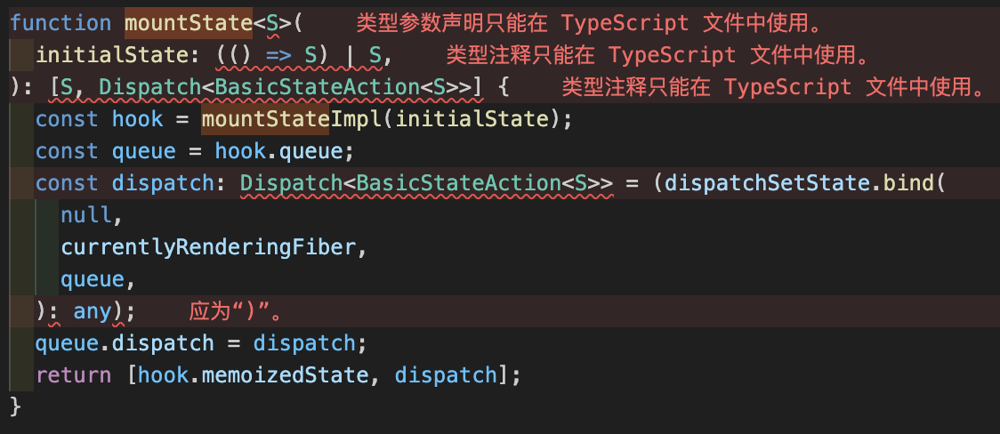
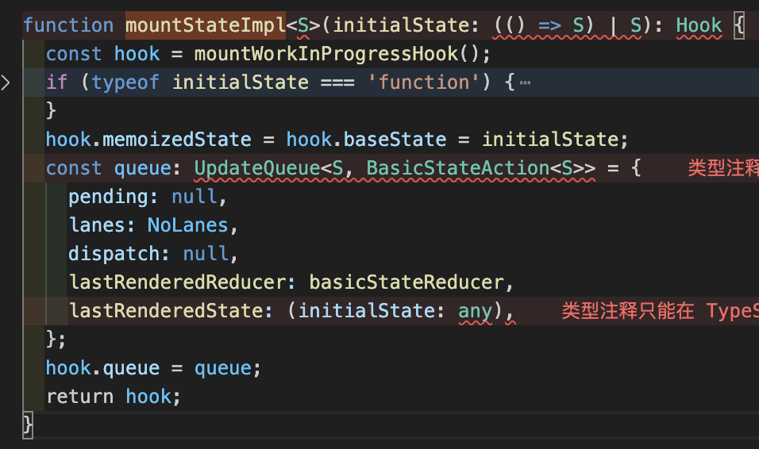
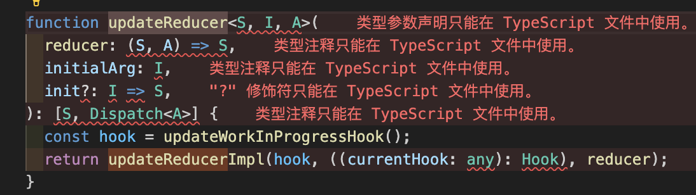
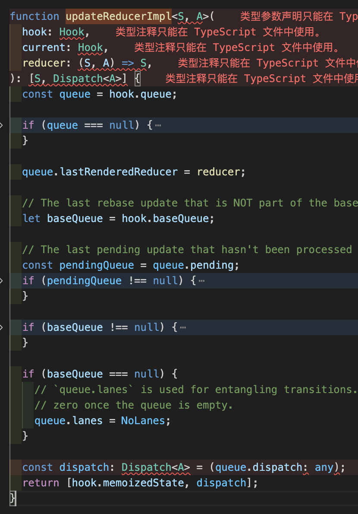
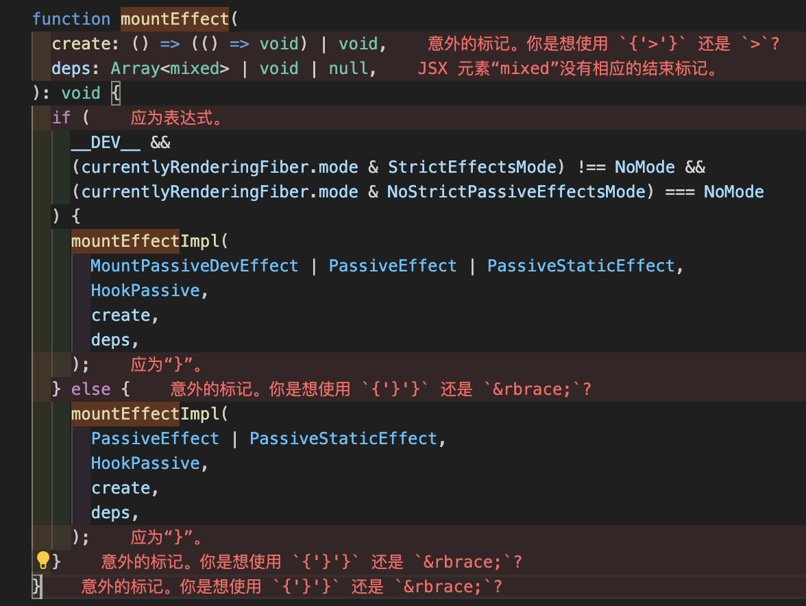
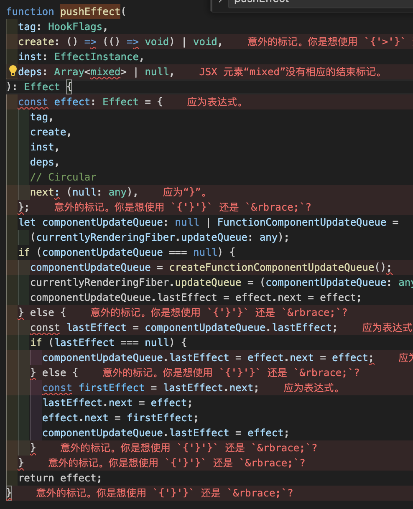

# useRef `https://blog.csdn.net/weixin_46463785/article/details/130648498`
// useRef会在所有的render中保持对返回值的唯一引用。因为所有对ref的赋值和取值拿到的都是最终的状态，
// 并不会因为不同的render中存在不同的隔离。
// 简单来说，你可以将useRef的返回值，想象成为一个全局变量。

// react 中有什么办法可以持久化一个变量，而且不用担心意外的变量回收？
// 答案是，useRef，它本身的逻辑就是分配一个脱离 react 声明周期的对象，并在 mount 时初始化一次，
// 之后通过 current 指针来修改或使用

function mountRef<T>(initialValue: T): {| current: T |} {
const hook = mountWorkInProgressHook();

// 存储数据，并返回这个数据
const ref = { current: initialValue };
hook.memoizedState = ref;
return ref;
}

HooksDispatcherOnRerender
function updateRef<T>(initialValue: T): {| current: T |} {
const hook = updateWorkInProgressHook();
return hook.memoizedState;
}

function updateRefresh(): any {
  const hook = updateWorkInProgressHook();
  return hook.memoizedState;
}

# useState `https://blog.csdn.net/It_kc/article/details/127508797`

- currentlyRenderingFiber：指当前渲染组件的 Fiber 对象，在我们的例子中，就是 App 对应的 Fiber 对象
- workInProgressHook：指当前运行到哪个 hooks 了，我们一个组件内部可以有多个 hook，而当前运行的 hook 只有一个。
- hook 节点：我们每一个 useState 语句，在初始化的时候，都会产生一个对象，来记录它的状态，我们称它为 hook 节点。

初始化渲染阶段:
`mountState`---> 中间调用 mountStateImpl 返回[hook.memoizedState, dispatch] 


`mountStateImpl` 创建queue  返回hook。



更新阶段：
`updateState`---> return updateReducer(basicStateReducer, initialState)

function  `basicStateReducer`<S>(state: S, action: BasicStateAction<S>): S {
  // $FlowFixMe[incompatible-use]: Flow doesn't like mixed types
  return typeof action === 'function' ? action(state) : action;
}
`updateReducer`  拿到当前hook 返回 updateReducerImpl


`updateReducerImpl` return [hook.memoizedState, dispatch];
函数用于根据传入的 reducer 函数和当前状态，计算并返回更新后的状态，并提供一个 dispatch 函数用于触发状态更新。这个函数在 React 内部被用于处理 Hook 的状态更新逻辑。



const [myArray, setMyArray] = useState();
setMyArray([...myArray, 'new item'])

`简易版useState()`
let state; // 用于存储状态值
let listeners = []; // 用于存储状态变化时的监听函数数组

function useState(initialValue) {
state = state || initialValue; // 如果状态值还未初始化，则使用初始值进行初始化

function setState(newState) {
state = newState; // 更新状态值

    // 触发状态变化时的监听函数
    for (let i = 0; i < listeners.length; i++) {
      listeners[i]();
    }

}

function getState() {
return state; // 返回当前状态值
}

// 注册状态变化时的监听函数，并返回当前状态值及状态更新函数
listeners.push(() => {
const value = getState();
setState(value);
});

return [getState(), setState]; // 返回当前状态值及状态更新函数
}

# useEffect  `https://jser.dev/2023-07-08-how-does-useeffect-work/#32-flushpassiveeffects` `https://juejin.cn/post/7215485778029723706`

`mountEffect`---> mountEffectImpl(MountPassiveDevEffect | PassiveEffect | PassiveStaticEffect, HookPassive,create, deps,);

```
function `mountEffectImpl`(
  fiberFlags: Flags,
  hookFlags: HookFlags,
  create: () => (() => void) | void,
  deps: Array<mixed> | void | null,
): void {
  const hook = mountWorkInProgressHook();
  const nextDeps = deps === undefined ? null : deps;
  currentlyRenderingFiber.flags |= fiberFlags;
  hook.memoizedState = pushEffect(
    HookHasEffect | hookFlags,
    create,
    createEffectInstance(),
    nextDeps,
  );
}
```
`pushEffect`


```
function updateEffectImpl(
  fiberFlags: Flags,
  hookFlags: HookFlags,
  create: () => (() => void) | void,
  deps: Array<mixed> | void | null,
): void {
  const hook = updateWorkInProgressHook();
  const nextDeps = deps === undefined ? null : deps;
  const effect: Effect = hook.memoizedState;
  const inst = effect.inst;

  // currentHook is null on initial mount when rerendering after a render phase
  // state update or for strict mode.
  if (currentHook !== null) {
    if (nextDeps !== null) {
      const prevEffect: Effect = currentHook.memoizedState;
      const prevDeps = prevEffect.deps;
      if (areHookInputsEqual(nextDeps, prevDeps)) {
        hook.memoizedState = pushEffect(hookFlags, create, inst, nextDeps);
        return;
      }
    }
  }

  currentlyRenderingFiber.flags |= fiberFlags;

  hook.memoizedState = pushEffect(
    HookHasEffect | hookFlags,
    create,
    inst,
    nextDeps,
  );
}
```

```
type EffectInstance = {
  destroy: void | (() => void),
};

export type Effect = {
  tag: HookFlags,
  create: () => (() => void) | void,
  inst: EffectInstance,
  deps: Array<mixed> | null,
  next: Effect,
};
```


`简易版本useEffect`
let _deps;

function useEffect(callback, dependencies) {
  const hasChanged = _deps
    && !dependencies.every((el, i) => el === _deps[i])
    || true;
  // 如果 dependencies 不存在，或者 dependencies 有变化，就执行 callback
  if (!dependencies || hasChanged) {
    callback();
    _deps = dependencies;
  }
}

# return 
## 在组件挂载时订阅事件
const subscription = someEventEmitter.subscribe(handleEvent);

// 返回一个清理函数，在组件卸载时取消订阅
return () => {
  subscription.unsubscribe();
};

## 清除定时器
const timerId = setInterval(() => {
    // 执行定时操作
  }, 1000);

  // 返回清理函数，在组件卸载或下一次副作用操作前清除定时器
  return () => {
    clearInterval(timerId);
  };

## 关闭WebSocket连接
 const socket = new WebSocket('wss://socket.example.com');

  // 添加事件监听器等WebSocket配置

  // 返回清理函数，在组件卸载或下一次副作用操作前关闭WebSocket连接
  return () => {
    socket.close();
  };

## 取消键盘事件监听  或者元素绑定事件
    window.addEventListener('keypress', handleKeyPress);

    // 返回清理函数，在组件卸载或下一次副作用操作前取消键盘事件监听
    return () => {
      window.removeEventListener('keypress', handleKeyPress);
    };

# useLayoutEffect 详解

当组件所有 DOM 都渲染完成后，同步调用 useLayoutEffect，然后再调用 useEffect。
异步调用---useEffect
同步调用---useLayoutEffect
useLayoutEffect 永远要比 useEffect 先触发完成。

# useMemo

function mountMemo<T>(
  nextCreate: () => T,
  deps: Array<mixed> | void | null,
): T {
  const hook = mountWorkInProgressHook();
  const nextDeps = deps === undefined ? null : deps;
  if (shouldDoubleInvokeUserFnsInHooksDEV) {
    nextCreate();
  }
  const nextValue = nextCreate();
  hook.memoizedState = [nextValue, nextDeps];
  return nextValue;
}

function updateMemo<T>(
  nextCreate: () => T,
  deps: Array<mixed> | void | null,
): T {
  const hook = updateWorkInProgressHook();
  const nextDeps = deps === undefined ? null : deps;
  const prevState = hook.memoizedState;
  // Assume these are defined. If they're not, areHookInputsEqual will warn.
  if (nextDeps !== null) {
    const prevDeps: Array<mixed> | null = prevState[1];
    if (areHookInputsEqual(nextDeps, prevDeps)) {
      return prevState[0];
    }
  }
  if (shouldDoubleInvokeUserFnsInHooksDEV) {
    nextCreate();
  }
  const nextValue = nextCreate();
  hook.memoizedState = [nextValue, nextDeps];
  return nextValue;
}


`2123312`

# useImperativeHandle 详解

import React, { useRef, useImperativeHandle } from 'react';
import ReactDOM from 'react-dom';

const FancyInput = React.forwardRef((props, ref) => {
const inputRef = useRef();
useImperativeHandle(ref, () => ({
focus: () => {
inputRef.current.focus();
}
}));
return <input ref={inputRef} type="text" />
});

const App = props => {
const fancyInputRef = useRef();

return (
<div>
<FancyInput ref={fancyInputRef} />
<button
onClick={() => fancyInputRef.current.focus()} // 调用子组件的方法 >父组件调用子组件的 focus</button>
</div>
)
}
ReactDOM.render(<App />, root);

# forwardRef 详解

想在函数组件中使用 ref，就一定会用到 forwardRef。
在函数组建中，props 无法传递 ref 属性，而 forwardRef 可以多接受一个 ref 参数，从而实现 ref 在函数组件中的传递

传递一个函数

A————B——————C
forwardRef 直接 A---------C

const App = (props) => {
const btnRef = React.createRef() // 1
useEffect(() => {
console.log(btnRef) // 5
}, [btnRef]);
return (
<Button ref={btnRef}>一个按钮</Button> // 2
);
}

const Button = React.forwardRef((props, ref) => { // 3
return (
<button
ref={ref} // 4 >
{props.children}
</button>
);
});

export default App;

# useCallback 用法及源码
传个变量去子组件 当变量不改变是组件不会刷新,但是传入的是函数，不行，走不通。会重新渲染。
`useCallback的依赖改变就会渲染`

## useCallback用法：
### 父组件**/
const Parent = () => {
    const [parentState,setParentState] = useState(0);  //父组件的state
    
    //11111
    const toChildFun = () => {
        console.log("需要传入子组件的函数");
    }
    //22222
    const toChildFun = useCallback(()=>{
        console.log("需要传入子组件的函数");
    },[])
    
    return (<div>
          <Button onClick={() => setParentState(val => val+1)}>
              点击我改变父组件中与Child组件无关的state
          </Button>
          //将父组件的函数传入子组件
          <Child count={count} fun={toChildFun}></Child>
    <div>)
}

### memo保护的子组件
const Child = memo(() => {
    console.log("我被打印了就说明子组件重新构建了")
    return <div><div>
})


# useCallback 源码解析
function useCallback(callback, deps) {
// 从 Hook 环境中获取当前的 Fiber 对象
const fiber = getWorkInProgressFiber();

// 获取或创建 memoizedState 对象
const { memoizedState } = fiber;

// 如果 memoizedState 对象不存在，或者依赖项有变化，就需要重新计算回调函数
if (memoizedState === null || depsAreDifferent(deps, memoizedState.deps)) {
const nextDeps = deps === undefined ? null : deps;
// 创建一个新的 memoizedState 对象
const newState = {
deps: nextDeps,
callback: callback,
// 缓存一个 memoized 的回调函数
// 该函数会调用最新的 callback 来执行实际的操作
memoizedCallback: function(...args) {
return newState.callback.apply(this, args);
},
};
// 更新 fiber 对象的 memoizedState
fiber.memoizedState = newState;
return newState.memoizedCallback;
}

// 返回缓存的 memoized 回调函数
return memoizedState.memoizedCallback;
}

# useReducer `https://reactjs.org/docs/hooks-reference.html#usereducer`

const initialState = {n: 0}
const reducer = (state, action) => {
  switch (action.type) {
    case '+':
        return {n: state.n + 1};
    case '-':
        return {n: state.n - 1};
    default:
      alert('unknow type')
      break;
  }
}
function App() {
  const [state, dispatch] = useReducer(reducer, initialState)
  return (
    <div className="App">
      <h1>n: {state.n}</h1>
      <button onClick={() => dispatch({type: '+'})}>+1</button>
      <button onClick={() => dispatch({type: '-'})}>-1</button>
    </div>
  );
}

# useContext

## 源码解析
function mountWorkInProgressHook(): Hook {
  const hook: Hook = {
    memoizedState: null,

    baseState: null,
    baseQueue: null,
    queue: null,

    next: null,
  };

  if (workInProgressHook === null) {
    // This is the first hook in the list
    currentlyRenderingFiber.memoizedState = workInProgressHook = hook;
  } else {
    // Append to the end of the list
    workInProgressHook = workInProgressHook.next = hook;
  }
  return workInProgressHook;
}


export function render(
element: React$Element<any>,
container: Container,
callback: ?Function,
) {

const internalContainerInstanceKey = '\_\_reactContainer$' + randomKey;

function legacyRenderSubtreeIntoContainer(
parentComponent: ? React$Component < any, any > ,
children : ReactNodeList,
container: Container,
forceHydrate: boolean,
callback: ? Function,
) {

    let fiberRoot: FiberRoot;

    function FiberRootNode(containerInfo, tag, hydrate) {
    this.tag = tag;
    this.containerInfo = containerInfo;
    this.pendingChildren = null;
    this.current = null;
    this.pingCache = null;
    this.finishedWork = null;
    this.timeoutHandle = noTimeout;
    this.context = null;
    this.pendingContext = null;
    this.isDehydrated = hydrate;
    this.callbackNode = null;
    this.callbackPriority = NoLane;
    this.eventTimes = createLaneMap(NoLanes);
    this.expirationTimes = createLaneMap(NoTimestamp);

    this.pendingLanes = NoLanes; //二进制
    this.suspendedLanes = NoLanes;
    this.pingedLanes = NoLanes;
    this.expiredLanes = NoLanes;
    this.mutableReadLanes = NoLanes;
    this.finishedLanes = NoLanes;

    this.entangledLanes = NoLanes;
    this.entanglements = createLaneMap(NoLanes);

function mountEffect(
create: () => (() => void) | void,
deps: Array<mixed> | void | null,
): void {

if (**DEV**) {
// $FlowExpectedError - jest isn't a global, and isn't recognized outside of tests
if ('undefined' !== typeof jest) {
warnIfNotCurrentlyActingEffectsInDEV(currentlyRenderingFiber);
}
}
if (
**DEV** &&
enableStrictEffects &&
(currentlyRenderingFiber.mode & StrictEffectsMode) !== NoMode
) {
return mountEffectImpl(
MountPassiveDevEffect | PassiveEffect | PassiveStaticEffect,
HookPassive,
create,
deps,
);
} else {
return mountEffectImpl(
PassiveEffect | PassiveStaticEffect,
HookPassive,
create,
deps,
);
}
} // 判断条件后执行 mountEffectImpl

function mountEffectImpl(fiberFlags, hookFlags, create, deps): void {
const hook = mountWorkInProgressHook();
const nextDeps = deps === undefined ? null : deps;
currentlyRenderingFiber.flags |= fiberFlags;
hook.memoizedState = pushEffect(
HookHasEffect | hookFlags,
create, //相当于第一参数
undefined,
nextDeps, //相当于依赖项
);
}

function mountRef<T>(initialValue: T): {|current: T|} {
const hook = mountWorkInProgressHook();
if (enableUseRefAccessWarning) {
if (**DEV**) {
// Support lazy initialization pattern shown in docs.
// We need to store the caller stack frame so that we don't warn on subsequent renders.
let hasBeenInitialized = initialValue != null;
let lazyInitGetterStack = null;
let didCheckForLazyInit = false;

      // Only warn once per component+hook.
      let didWarnAboutRead = false;
      let didWarnAboutWrite = false;

      let current = initialValue;
      const ref = {
        get current() {
          if (!hasBeenInitialized) {
            didCheckForLazyInit = true;
            lazyInitGetterStack = getCallerStackFrame();
          } else if (currentlyRenderingFiber !== null && !didWarnAboutRead) {
            if (
              lazyInitGetterStack === null ||
              lazyInitGetterStack !== getCallerStackFrame()
            ) {
              didWarnAboutRead = true;
              console.warn(
                '%s: Unsafe read of a mutable value during render.\n\n' +
                  'Reading from a ref during render is only safe if:\n' +
                  '1. The ref value has not been updated, or\n' +
                  '2. The ref holds a lazily-initialized value that is only set once.\n',
                getComponentNameFromFiber(currentlyRenderingFiber) || 'Unknown',
              );
            }
          }
          return current;
        },
        set current(value) {
          if (currentlyRenderingFiber !== null && !didWarnAboutWrite) {
            if (
              hasBeenInitialized ||
              (!hasBeenInitialized && !didCheckForLazyInit)
            ) {
              didWarnAboutWrite = true;
              console.warn(
                '%s: Unsafe write of a mutable value during render.\n\n' +
                  'Writing to a ref during render is only safe if the ref holds ' +
                  'a lazily-initialized value that is only set once.\n',
                getComponentNameFromFiber(currentlyRenderingFiber) || 'Unknown',
              );
            }
          }

          hasBeenInitialized = true;
          current = value;
        },
      };
      Object.seal(ref);
      hook.memoizedState = ref;
      return ref;
    } else {
      const ref = {current: initialValue};
      hook.memoizedState = ref;
      return ref;
    }

} else {
const ref = {current: initialValue};
hook.memoizedState = ref;
return ref;
}
}

function updateRef<T>(initialValue: T): {|current: T|} {
const hook = updateWorkInProgressHook();
return hook.memoizedState;
}

function mountMemo<T>(
nextCreate: () => T, //对应第一个参数
deps: Array<mixed> | void | null, //对应依赖项
): T {
const hook = mountWorkInProgressHook();
const nextDeps = deps === undefined ? null : deps;
const nextValue = nextCreate(); // 执行一遍函数 返回执行后的结果进行一次处理
hook.memoizedState = [nextValue, nextDeps];
return nextValue;
}

function updateMemo<T>(
nextCreate: () => T,
deps: Array<mixed> | void | null,
): T {
const hook = updateWorkInProgressHook();
const nextDeps = deps === undefined ? null : deps;
const prevState = hook.memoizedState;
if (prevState !== null) {
// Assume these are defined. If they're not, areHookInputsEqual will warn.
if (nextDeps !== null) {
const prevDeps: Array<mixed> | null = prevState[1];
if (areHookInputsEqual(nextDeps, prevDeps)) { //进行一次浅比较
return prevState[0];
}
}
}
const nextValue = nextCreate();
hook.memoizedState = [nextValue, nextDeps];
return nextValue;
}

function mountCallback<T>(callback: T, deps: Array<mixed> | void | null): T {
const hook = mountWorkInProgressHook();
const nextDeps = deps === undefined ? null : deps;
hook.memoizedState = [callback, nextDeps];
return callback;
}

function updateCallback<T>(callback: T, deps: Array<mixed> | void | null): T {
const hook = updateWorkInProgressHook();
const nextDeps = deps === undefined ? null : deps;
const prevState = hook.memoizedState;
if (prevState !== null) {
if (nextDeps !== null) {
const prevDeps: Array<mixed> | null = prevState[1];
if (areHookInputsEqual(nextDeps, prevDeps)) {
return prevState[0];
}
}
}
hook.memoizedState = [callback, nextDeps];
return callback;
}

useImperativeHandle<T>(
ref: {|current: T | null|} | ((inst: T | null) => mixed) | null | void,
create: () => T,
deps: Array<mixed> | void | null,
): void {
currentHookNameInDev = 'useImperativeHandle';
mountHookTypesDev();
checkDepsAreArrayDev(deps);
return mountImperativeHandle(ref, create, deps);
},

function mountImperativeHandle<T>(
ref: {|current: T | null|} | ((inst: T | null) => mixed) | null | void,
create: () => T,
deps: Array<mixed> | void | null,
): void {
if (**DEV**) {
if (typeof create !== 'function') {
console.error(
'Expected useImperativeHandle() second argument to be a function ' +
'that creates a handle. Instead received: %s.',
create !== null ? typeof create : 'null',
);
}
}

// TODO: If deps are provided, should we skip comparing the ref itself?
const effectDeps =
deps !== null && deps !== undefined ? deps.concat([ref]) : null;

let fiberFlags: Flags = UpdateEffect;
if (enableSuspenseLayoutEffectSemantics) {
fiberFlags |= LayoutStaticEffect;
}
if (
**DEV** &&
enableStrictEffects &&
(currentlyRenderingFiber.mode & StrictEffectsMode) !== NoMode
) {
fiberFlags |= MountLayoutDevEffect;
}
return mountEffectImpl(
fiberFlags,
HookLayout,
imperativeHandleEffect.bind(null, create, ref),
effectDeps,
);
}

例子：
const checkboxRef = useMemo<CheckboxRef>(() => {
return {
root: rootRef.current,
toggle: handleToggle,
};
}, [handleToggle]);

    useImperativeHandle<CheckboxRef, CheckboxRef>(ref, () => checkboxRef, [
        checkboxRef,
    ]);

调度阶段(reconciliation)：在这个阶段 React 会更新数据生成新的 Virtual DOM，然后通过 Diff 算法（深度优先算法）（ChildReconciler return reconcileChildFibers ），快速找出需要更新的元素，放到更新队列中去，得到新的更新队列。

function reconcileChildFibers(
returnFiber: Fiber,
currentFirstChild: Fiber | null,
newChild: any,
lanes: Lanes, //react 17 优化
//React16 的 expirationTimes 模型只能区分是否>=expirationTimes 决定节点
//否更新。React17 的 lanes 模型可以选定一个更新区间，并且动态的向区间中增减
//优先级，可以处理更细粒度的更新。
): Fiber | null {}

function reconcileChildrenArray(
returnFiber: Fiber,
currentFirstChild: Fiber | null,
newChildren: Array<\*>,
lanes: Lanes,
): Fiber | null {
// returnFiber：currentFirstChild 的父级 fiber 节点
// currentFirstChild：当前执行更新任务的 WIP（fiber）节点
// newChildren：组件的 render 方法渲染出的新的 ReactElement 节点
// lanes：优先级相关

    // resultingFirstChild是diff之后的新fiber链表的第一个fiber。
    let resultingFirstChild: Fiber | null = null;
    // resultingFirstChild是新链表的第一个fiber。

    // previousNewFiber用来将后续的新fiber接到第一个fiber之后
    let previousNewFiber: Fiber | null = null;

    // oldFiber节点，新的child节点会和它进行比较
    let oldFiber = currentFirstChild;

    // 存储固定节点的位置
    let lastPlacedIndex = 0;

    // 存储遍历到的新节点的索引
    let newIdx = 0;

    // 记录目前遍历到的oldFiber的下一个节点
    let nextOldFiber = null;

    // 该轮遍历来处理节点更新，依据节点是否可复用来决定是否中断遍历
    for (; oldFiber !== null && newIdx < newChildren.length; newIdx++) {
        // newChildren遍历完了，oldFiber链没有遍历完，此时需要中断遍历
        if (oldFiber.index > newIdx) {
            nextOldFiber = oldFiber; oldFiber = null;
        } else {
            // 用nextOldFiber存储当前遍历到的oldFiber的下一个节点
            nextOldFiber = oldFiber.sibling;
        }
        // 生成新的节点，判断key与tag是否相同就在updateSlot中
        // 对DOM类型的元素来说，key 和 tag都相同才会复用oldFiber
        // 并返回出去，否则返回null
        const newFiber = updateSlot(
            returnFiber,
            oldFiber,
            newChildren[newIdx],
            lanes,
        );

        // newFiber为 null说明 key 或 tag 不同，节点不可复用，中断遍历
        if (newFiber === null) {
            if (oldFiber === null) {
            // oldFiber 为null说明oldFiber此时也遍历完了
            // 是以下场景，D为新增节点
            // 旧 A - B - C
            // 新 A - B - C - D oldFiber = nextOldFiber;
            }
            break;
        }
        if (shouldTrackSideEffects) {
            // shouldTrackSideEffects 为true表示是更新过程
            if (oldFiber && newFiber.alternate === null) {
                // newFiber.alternate 等同于 oldFiber.alternate
                // oldFiber为WIP节点，它的alternate 就是 current节点
                // oldFiber存在，并且经过更新后的新fiber节点它还没有current节点,
                // 说明更新后展现在屏幕上不会有current节点，而更新后WIP
                // 节点会称为current节点，所以需要删除已有的WIP节点
                deleteChild(returnFiber, oldFiber);
                }
            }
            // 记录固定节点的位置
            lastPlacedIndex = placeChild(newFiber, lastPlacedIndex, newIdx);
            // 将新fiber连接成以sibling为指针的单向链表
            if (previousNewFiber === null) {
                resultingFirstChild = newFiber;
            } else {
                previousNewFiber.sibling = newFiber;
            }
            previousNewFiber = newFiber;
            // 将oldFiber节点指向下一个，与newChildren的遍历同步移动
            oldFiber = nextOldFiber;
         }

        // 处理节点删除。新子节点遍历完，说明剩下的oldFiber都是没用的了，可以删除.
        if (newIdx === newChildren.length) {
            // newChildren遍历结束，删除掉oldFiber链中的剩下的节点
            deleteRemainingChildren(returnFiber, oldFiber);
            return resultingFirstChild;
        }

        // 处理新增节点。旧的遍历完了，能复用的都复用了，所以意味着新的都是新插入的了
        if (oldFiber === null) {
            for (; newIdx < newChildren.length; newIdx++) {

                // 基于新生成的ReactElement创建新的Fiber节点
                const newFiber = createChild(returnFiber, newChildren[newIdx], lanes);
                if (newFiber === null) {
                    continue;
                }
                // 记录固定节点的位置lastPlacedIndex
                lastPlacedIndex = placeChild(newFiber, lastPlacedIndex, newIdx);
                // 将新生成的fiber节点连接成以sibling为指针的单向链表
                if (previousNewFiber === null) {
                    resultingFirstChild = newFiber;
                } else {
                    previousNewFiber.sibling = newFiber;
                }
                previousNewFiber = newFiber;
            }
            return resultingFirstChild;
        }
        // 执行到这是都没遍历完的情况，把剩余的旧子节点放入一个以key为键,值为oldFiber节点的map中
        // 这样在基于oldFiber节点新建新的fiber节点时，可以通过key快速地找出oldFiber
        const existingChildren = mapRemainingChildren(returnFiber, oldFiber);

        // 节点移动
        for (; newIdx < newChildren.length; newIdx++) {
            // 基于map中的oldFiber节点来创建新fiber
            const newFiber = updateFromMap( existingChildren, returnFiber, newIdx, newChildren[newIdx], lanes, );
            if (newFiber !== null) {
                if (shouldTrackSideEffects) {
                    if (newFiber.alternate !== null) {
                        // 因为newChildren中剩余的节点有可能和oldFiber节点一样,只是位置换了，
                        // 但也有可能是是新增的.

                        // 如果newFiber的alternate不为空，则说明newFiber不是新增的。
                        // 也就说明着它是基于map中的oldFiber节点新建的,意味着oldFiber已经被使用了,所以需
                        // 要从map中删去oldFiber
                        existingChildren.delete(
                            newFiber.key === null ? newIdx : newFiber.key,
                        );
                     }
                  }

                 // 移动节点，多节点diff的核心，这里真正会实现节点的移动
                 lastPlacedIndex = placeChild(newFiber, lastPlacedIndex, newIdx);
                 // 将新fiber连接成以sibling为指针的单向链表
                if (previousNewFiber === null) {
                    resultingFirstChild = newFiber;
                } else {
                    previousNewFiber.sibling = newFiber;
                }
                previousNewFiber = newFiber;
            }
         }
        if (shouldTrackSideEffects) {
           // 此时newChildren遍历完了，该移动的都移动了，那么删除剩下的oldFiber
           existingChildren.forEach(child => deleteChild(returnFiber, child));
        }
        return resultingFirstChild;

}
