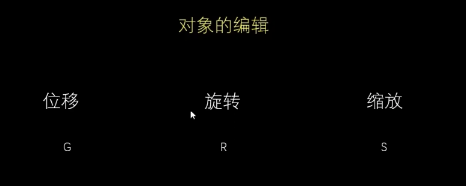
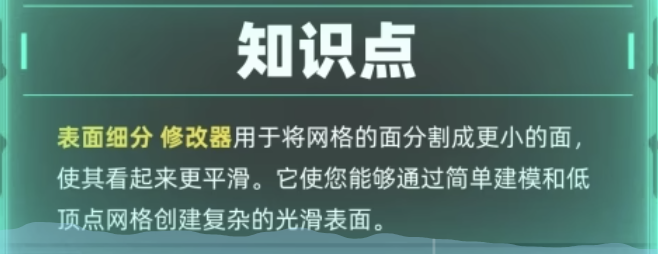

G R S 
X Y Z

# shift + 滑动  可以改变视图中心点

# S键 + XYZ 可以放大缩小 

切换 点  面 模式（tab键）

shift+ A  新建 

倒角(圆角) control+B

复制 shift+D 

镜像复制

设置原点 (物体---设置原点---原点到集合中心位置)

cycle 渲染器
右下角 摄像机-----渲染引擎----最好把最大采样数据变小一点

0 可以显示摄像机所看到的位置

右边工具栏----视图---相机锁定

左上角 3D视图切换成 着色器编译器

着色器编译器----选择世界

右上角 第三个圆是 材质预览

#  选中一个点 + ALT(option) 可以循环选中

 # shift + alt 可以同时选中两个循环边

# control+R  循环切割  可以切割一圈点出来 

(s键) 可以扩大和缩小一些点

在面的模式下
# I键 可以插入  配合E键 可以挤压

右键 沿法线挤出面  可以整体沿着法线挤压

透显模式	ALT+Z

在物体模式 

#  选中所有的点 + F  可以封面

表面细分(右边修改器)

# 字体  修改器----实体化修改器    注意厚度和偏移量

 shift + 鼠标右键   移动瞄准点

#  关联物体
