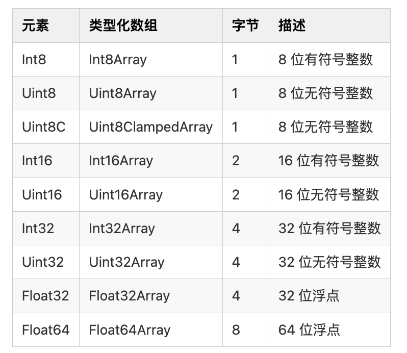
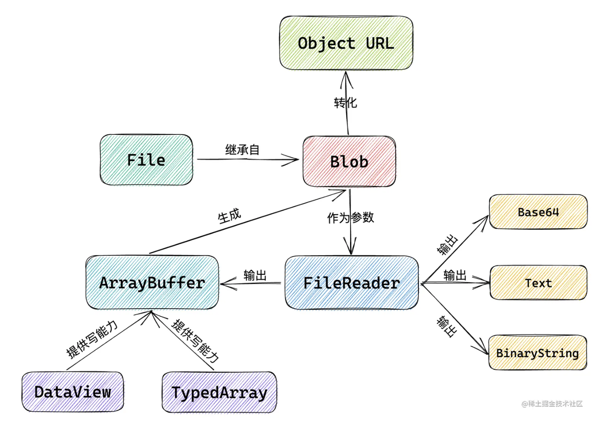
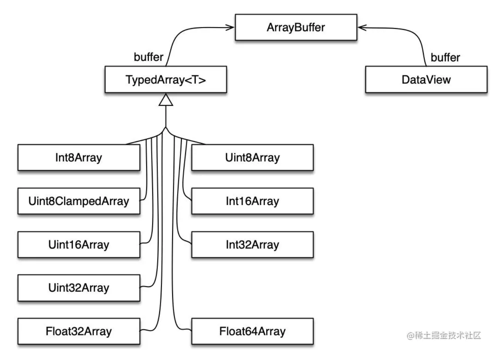

1byte(字节) = 8bit(位) 怎么理解？？
1 字节(byte)等于 8 位(bit),这是因为计算机中的数据存储和传输是以位为单位的。
位是计算机中最小的存储单位,它可以表示 0 或 1 两种状态。而字节是由 8 个位组成的,可以表示 256 种不同的状态(2 的 8 次方)
🌰：一个字节可以表示的最小值是 00000000(二进制)相当于(十进制的 0),最大值是 11111111(二进制),相当于十进制的(255)

Number 类型在内存中占用的空间通常是 8 个字节(64 位) 通常被放在栈内存中
JavaScript 使用了 Unicode 字符集来表示字符串,其中大多数字符使用 16 位编码(即 2 个字节)。然而，对于一些特殊字符（如表情符号、某些汉字等），可能需要使用更多的字节来表示。

1byte = 8bit
1byte = 1B
1KB = 1024B
1MB = 1024KB
1GB = 1024MB
1TB = 1024GB

a=25
b=0b11001;// 0b 表示二进制  
c=0o31;// 0o 八进制
d=0x19;//0x 十六进制

# encodeURI encodeURIComponent (escape 已移除)

encodeURI 方法不会对下列字符编码: ASCII 字母 、数字、~!@#$&_()=:/,;?+'。
encodeURIComponent 方法不会对下列字符编码: ASCII 字母 、数字、~!_()'

ASCII 字母: \u0068\u0065\u006c\u006c\u006f \u4f60\u597d

# encodeURI encodeURIComponent 用法

// 编码
encodeURI("编码 randy~!@#$&*()=:/,;?+'") // %E7%BC%96%E7%A0%81randy~!@#$&_()=:/,;?+'
// 解码
decodeURI("%E7%BC%96%E7%A0%81randy~!@#$&_()=:/,;?+'") // 编码 randy~!@#$&\_()=:/,;?+'

// 编码
encodeURIComponent("编码 randy~!_()'"); // %E7%BC%96%E7%A0%81randy~!_()'
// 解码
decodeURIComponent("%E7%BC%96%E7%A0%81randy~!\_()'"); // 编码 randy~!\*()'

# File

文件（File）接口提供有关文件的信息，并允许网页中的 JavaScript 访问其内容。实际上，File 对象是特殊类型的 Blob，且可以用在任意的 Blob 类型的 context 中。Blob 的属性和方法都可以用于 File 对象。

注意：File 对象中只存在于浏览器环境中，在 Node.js 环境中不存在。

const file1 = new File(["文件对象"], "test", { type: "text/plain" });
// 输出的对象有如下属性
// lastModified: 1640589621358
// lastModifiedDate: Mon Dec 27 2021 15:20:21 GMT+0800 (中国标准时间) {}
// name: "test"
// size: 12
// type: "text/plain"
// webkitRelativePath: ""
console.log(file1);

slice() 从 Blob 中截取一部分并返回一个新的 Blob(用法同数组的 slice)
arrayBuffer() 返回一个以二进制形式展现的 promise
stream() 返回一个 ReadableStream 对象
text() 返回一个文本形式的 promise

## File 转换

// 转成 stream
console.log(file1.stream());
// 转成 Arraybuffer
file1.arrayBuffer().then((res) => {
console.log(res);
});
// 转成文本
file1.text().then((res) => {
console.log(res);
});

# Blob

Blob 全称为 binary large object ，即二进制大对象，它是 JavaScript 中的一个对象，表示原始的类似文件的数据
Blob 对象表示一个不可变、原始数据的类文件对象。它的数据可以按文本或二进制的格式进行读取，也可以转换成 ReadableStream 来用于数据操作

## Blob 用法

const blob = new Blob(["Hello World"], {type: "text/plain"});

## 转化 blob

iframe.src = URL.createObjectURL(blob);

## Blob 分片

const blob = instanceOfBlob.slice({[start [, end [, contentType]]]});

# FileReader

FileReader 是一个异步 API，用于读取文件并提取其内容以供进一步使用。FileReader 可以将 Blob 读取为不同的格式。

# ArrayBuffer

ArrayBuffer 对象用来表示通用的、固定长度的原始二进制数据缓冲区。ArrayBuffer 的内容不能直接操作，只能通过 DataView 对象或 TypedArrray 对象来访问。这些对象用于读取和写入缓冲区内容。

# FileReader.readAsBinaryString(): 该方法用于将文件读取为二进制字符串。

const fileReader = new FileReader();
fileReader.onload = function(event) {
const binaryString = event.target.result;
// 处理读取到的二进制字符串
};

fileReader.readAsBinaryString(file);

# FileReader.readAsDataURL(): 该方法用于将文件读取为 Data URL 格式的字符串。

const fileReader = new FileReader();
fileReader.onload = function(event) {
const dataURL = event.target.result;
// 处理读取到的 Data URL 字符串
};

fileReader.readAsDataURL(file);

# FileReader.readAsText(): 该方法用于将文件读取为文本字符串。

const fileReader = new FileReader();
fileReader.onload = function(event) {
const text = event.target.result;
// 处理读取到的文本字符串
};

## FileReader.readAsArrayBuffer(blob): 该方法用于将文件读取为一个包含文件内容的 ArrayBuffer 对象。

const fileReader = new FileReader();
fileReader.onload = function(event) {
const arrayBuffer = event.target.result;
// 处理读取到的 ArrayBuffer 对象
};

fileReader.readAsArrayBuffer(blob);

## ArrayBuffer.prototype.slice(): 该方法用于创建一个原始 ArrayBuffer 对象的一部分副本。

const buffer = new ArrayBuffer(10);
const slicedBuffer = buffer.slice(2, 6);

## ArrayBufferView: 一组允许直接操作 ArrayBuffer 内容的视图类型，如 TypedArray 和 DataView。

const buffer = new ArrayBuffer(8);
const int32View = new Int32Array(buffer);
int32View[0] = 42;

## new DataView(buffer): 创建一个新的 DataView 对象来操作给定的 ArrayBuffer 或 SharedArrayBuffer。

const buffer = new ArrayBuffer(16);
const dataView = new DataView(buffer);
dataView.setInt32(0, 42, true); // 设置偏移量 0 处的 32 位整数为 42

## Base64: 一种用 64 个字符表示二进制数据的编码方式，常用于在文本协议中传输二进制数据。

const encodedData = btoa('Hello, World!'); // 编码
const decodedData = atob(encodedData); // 解码

const blob = new Blob([new Uint8Array(buffer, byteOffset, length)]);
const base64 = btoa(String.fromCharCode.apply(null, new Uint8Array(arrayBuffer)));

## ReadableStream: JavaScript 中用于处理流数据的 API，可以异步处理从数据源读取的数据流。

const stream = new ReadableStream({
start(controller) {
// 在此处生成流数据并通过 controller.enqueue()发送
}
});
// 使用 stream 进行后续操作，例如使用 pipeTo()方法连接到其他流

# formData

formData = new FormData(someFormElement);
formData.append('name', 25);
formData.get('name');
formData.getAll("name")
formData.delete("name");
formData.has("name");
