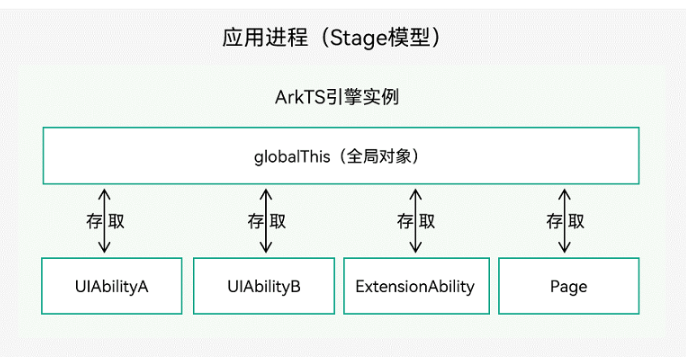

面向场景式编程  而不是之前的面向设备式编程

# 工具 DevEco Studio
DevEco Studio是面向HarmonyOS的全功能IDE，提供开箱即用的开发工具和调试能力，帮助开发者快速开发、调试和部署HarmonyOS应用。https://developer.huawei.com/consumer/cn/forum/topic/0201224183852740018

(选择ets文件 点击右侧的preview按钮可以预览页面)
可能会遇到的问题： build failed  可以 在preference--->build execution----> Hvigor---> 关闭 'Enable the Daemon'
(对应手机版本 切换对应的SDK)

打开模块的build.gradle（API4-7）或打开工程的build-profile.json5（API8-9）文件，查看compileSdkVersion、compatibleSdkVersion。

# 配置
export PATH="/Users/surcode/Library/Huawei/ohpm"


# ArkTS 语言
ArkTS是鸿蒙生态的应用开发语言。它在保持TypeScript（简称TS）基本语法风格的基础上，对TS的动态类型特性施加更严格的约束，引入静态类型。同时，提供了声明式UI、状态管理等相应的能力，让开发者可以以更简洁、更自然的方式开发高性能应用。


# 生命周期回调函数


# 声明式UI 状态驱动视图更新
Row(){}
Column(){}
Flex({ direction: FlexDirection.Row }) {}.height(70)

# API
@Builder

@State  
@Link
@Prop
@Extend 只定义全局
```
@Extend(Button)
function actionBtnStyle() {
  .fontSize()
}
```

状态管理
@Provide(RefreshConstants.REFRESH_STATE_TAG) state: number = RefreshState.REFRESHING;
@Consume(RefreshConstants.REFRESH_STATE_TAG) 

@Watch('onStateCheck') state: RefreshState;

ForEach(...{
        TodoItem(...)
      },...)


# 路由
import router from '@ohos.router';

router.pushUrl({
  url: 'pages/Second',
  params: {
    src: 'Index页面传来的数据',
  }
}, router.RouterMode.Single)

获取参数: (router.getParams() as Record<string, string>)['src']
返回指定页面: router.back({ url: 'pages/Index' })

# 动画
Image($r('app.media.image1'))   
   .animation({   
      duration: 1000,    
      tempo: 1.0,    
      delay: 0,    
      curve: Curve.Linear,    
      playMode: PlayMode.Normal,    
      iterations: 1  
   })

# 万能Card
https://www.bilibili.com/video/BV1FK4y167Re/?spm_id_from=333.788&vd_source=fcbe9920cae640e8ad1326cfb5c6b943

# 网络应用 
https://developer.huawei.com/consumer/cn/training/course/slightMooc/C101667364948559963
```
@Component
struct WebComponent {
  controller: WebController = new WebController();
  build() {
    Column() {
      Web({ src: 'https://developer.harmonyos.com/', controller: this.controller })
    }
  }
}
```
访问在线网页时您需要在module.json5文件中申明网络访问权限：ohos.permission.INTERNET。

## HTTP数据请求
import http from '@ohos.net.http';
let httpRequest = http.createHttp();
httpRequest.on('headersReceive', (header) => {
    console.info('header: ' + JSON.stringify(header));
});

# 原生与WEB通信

confirm()
runJavascript()

# 保存应用数据
首选项:为应用提供Key-Value键值型的数据存储能力，支持应用持久化轻量级数据，并对其进行增删改查等。该存储对象中的数据会被缓存在内存中，因此它可以获得更快的存取速度

保存数据（put）
获取数据（get）
是否包含指定的key（has）
删除数据（delete）、数据持久化（flush）


# 应用提醒和通知
import notification from '@ohos.notificationManager';
```
let notificationRequest: notification.NotificationRequest = { // 描述通知的请求
      id: 1, // 通知ID
      slotType: notification.SlotType.SERVICE_INFORMATION,
      content: { // 通知内容
        contentType: notification.ContentType.NOTIFICATION_CONTENT_BASIC_TEXT, // 普通文本类型通知
        normal: { // 基本类型通知内容
          title: '通知内容标题',
          text: '通知内容详情',
          additionalText: '通知附加内容', // 通知附加内容，是对通知内容的补充。
        }
      }
    }
    notification.publish(notificationRequest).then(() => { // 发布通知
      console.info('publish success');
    }).catch((err) => {
      console.error(`publish failed, dcode:${err.code}, message:${err.message}`);
    });

```


# 轻量化并发机制
ArkCompiler运行时在HarmonyOS上提供了Worker API支持并发编程。在运行时实例内存隔离的基础上，ArkCompiler通过共享运行实例中的不可变或者不易变的对象、内建代码块、方法字节码等技术手段，优化了并发运行实例的启动性能和内存开销。


### stage模型

Stage模型只提供了主线程和Worker线程，Emitter主要用于主线程和Worker线程、Worker线程和Worker线程之间的事件同步。


# 什么是UIAbility? https://developer.huawei.com/consumer/cn/training/course
系统调度单元

### UIAbility的启动模式
singleton（单实例模式）、standard（标准实例模式）、specified（指定实例模式）。

Singleton启动模式为单实例模式，是默认的启动模式。每次调用startAbility()方法时，如果应用进程中该类型的UIAbility实例已经存在，则复用该实例。系统中只存在唯一一个该UIAbility实例

Standard启动模式为标准实例模式，每次调用startAbility()方法时，都会在应用进程中创建一个新的该类型UIAbility实例。在最近任务列表中可以看到多个该类型的UIAbility实例。

Specified启动模式为指定实例模式，允许为UIAbility实例创建一个唯一的Key，后续每次调用startAbility()方法时，都会询问应用使用哪个Key对应的UIAbility实例来响应请求。
(在config.json中配置)

# 线程模型 + 进程模型

基于内存共享的并发模型。
基于消息通信的并发模型。
目前是Actor并发模型 
Actor模型的内存隔离特性，所以需要进行跨线程的数据序列化传输

UIAbility组件与UI的数据同步
https://www.seaxiang.com/blog/58fc4a3da87a40d7b2064650d78f1f5d
https://www.seaxiang.com/blog/32ed5033d58a4c1287cc7969e8a73154#eventhubon

在Worker线程中保存大数据，不阻塞主线程，建议耗时操作可以在子线程完成。


# UIAbility生命周期状态
使用EventHub进行数据通信 
EventHub为UIAbility组件提供了事件机制，使它们能够进行订阅、取消订阅和触发事件等数据通信能力


## Create状态
Create状态为在应用加载过程中，UIAbility实例创建完成时触发，系统会调用onCreate()回调。可以在该回调中进行应用初始化操作，例如变量定义资源加载等，用于后续的UI界面展示

## WindowStageCreate和WindowStageDestroy状态
UIAbility实例创建完成之后，在进入Foreground之前，系统会创建一个WindowStage。WindowStage创建完成后会进入onWindowStageCreate()回调，可以在该回调中设置UI界面加载、设置WindowStage的事件订阅。


```
import UIAbility from '@ohos.app.ability.UIAbility';
import Window from '@ohos.window';

export default class EntryAbility extends UIAbility {

    onCreate(want, launchParam) {
        // 应用初始化
    }

    onWindowStageCreate(windowStage: Window.WindowStage) {
        // 设置WindowStage的事件订阅（获焦/失焦、可见/不可见）

        // 设置UI界面加载
        windowStage.loadContent('pages/Index', (err, data) => {
            // ...
        });
    }

    onForeground() {
        //  切换前台的触发
        // 申请系统需要的资源，或者重新申请在onBackground中释放的资源
    }

    onBackground() {
        // 切换后台时候触发
        // 释放UI界面不可见时无用的资源，或者在此回调中执行较为耗时的操作
        // 例如状态保存等
    }

    onWindowStageDestroy() {
        // 释放UI界面资源 数据保存
    }

    onDestroy() {
        // 系统资源的释放、数据的保存等
    }
}

```

## 使用globalThis进行数据同步
globalThis是ArkTS引擎实例内部的一个全局对象，引擎内部的UIAbility/ExtensionAbility/Page都可以使用，因此可以使用globalThis全局对象进行数据同步



# 编译
DevEco Hvigor是使用TypeScript语言开发的全新轻量化的任务调度工具，针对HarmonyOS应用提供了一系列编译构建任务，支持将HarmonyOS应用编译构建出对应的产物包。作为一款HarmonyOS应用编译构建任务流工具，DevEco Hvigor具备许多可以提升构建效率的特性，支持多产物差异化构建，也支持HarmonyOS应用可分可合等特性。可以称得上是"麻雀虽小五脏俱全"

## 模块化编译
模块化就是每一个文件都是一个模块，每一个模块都会生成一个 .abc 字节码文件， 最后所有的 abc 文件会通过 sdk 里面的 merge_abc 工具打包到一个 modules.abc 中。
es2abc (C++编写) 是把 JS 转换成 abc 的工具。

ArkTS编译

### 任务分发 线程通信
线程模型概述:
在OpenHarmony应用中，每个进程都会有一个主线程，主线程具有以下职责：
1:执行UI绘制。
2:管理主线程的ArkTS引擎实例，使多个UIAbility组件能够运行在其之上。
3:管理其他线程的ArkTS引擎实例，例如启动和终止Worker线程。
4:分发交互事件。
5:处理应用代码的回调，包括事件处理和生命周期管理。
6:接收Worker线程发送的消息。


### 安全 访问权限 用户认证 加密密钥


# 第三方库
可以类比npm 
https://ohpm.openharmony.cn/#/cn/home


# 真机调试
https://developer.huawei.com/consumer/cn/forum/topic/0203461929487310027

# 服务上架


# HarmonyOS架构
内核层:
 Linux Kerne    liteOS  + HDF硬件驱动框架
框架层:
 UI框架 Ability框架 电话子系统 多媒体子系统 AI子系统   
应用层:
 用户APP 用户操作

技术特性：
1:硬件  资源共享
分布式软总线: 是各个设备的通信基座
分布式设备虚拟化
分布式任务调度


# HarmonyOS工作原理
元能力AA和FA


# 1: UI底层 怎么做渲染的 
鸿蒙的GUI系统: 框架层 引擎与运行时层 图形渲染层 这三个抽象层，整体构成了一套面向嵌入式硬件的 GUI 技术栈

# 2:多线程模型  

# 3:怎么编译运行 
ts2abc组件是方舟运行时子系统的前端工具，支持将JavaScript文件转换为方舟字节码文件。
ArkCompiler

并发模型是用来实现不同应用场景中并发任务的编程模型，常见的并发模型分为基于内存共享的并发模型和基于消息通信的并发模型


# DevEco Studio
DevEco Studio是面向HarmonyOS的全功能IDE，提供开箱即用的开发工具和调试能力，帮助开发者快速开发、调试和部署HarmonyOS应用。
(选择ets文件 点击右侧的preview按钮可以预览页面)
可能会遇到的问题： build failed  可以 在preference--->build execution----> Hvigor---> 关闭 'Enable the Daemon'

# ArkTS 语言
ArkTS是鸿蒙生态的应用开发语言。它在保持TypeScript（简称TS）基本语法风格的基础上，对TS的动态类型特性施加更严格的约束，引入静态类型。同时，提供了声明式UI、状态管理等相应的能力，让开发者可以以更简洁、更自然的方式开发高性能应用。


# 生命周期回调函数


# API
@Builder

@State  
@Link
@Prop


# 轻量化并发机制
ArkCompiler运行时在HarmonyOS上提供了Worker API支持并发编程。在运行时实例内存隔离的基础上，ArkCompiler通过共享运行实例中的不可变或者不易变的对象、内建代码块、方法字节码等技术手段，优化了并发运行实例的启动性能和内存开销。


# stage模型


# UIAbility生命周期状态


## Create状态
Create状态为在应用加载过程中，UIAbility实例创建完成时触发，系统会调用onCreate()回调。可以在该回调中进行应用初始化操作，例如变量定义资源加载等，用于后续的UI界面展示

## WindowStageCreate和WindowStageDestroy状态
UIAbility实例创建完成之后，在进入Foreground之前，系统会创建一个WindowStage。WindowStage创建完成后会进入onWindowStageCreate()回调，可以在该回调中设置UI界面加载、设置WindowStage的事件订阅。


```
import UIAbility from '@ohos.app.ability.UIAbility';
import Window from '@ohos.window';

export default class EntryAbility extends UIAbility {

    onCreate(want, launchParam) {
        // 应用初始化
    }

    onWindowStageCreate(windowStage: Window.WindowStage) {
        // 设置WindowStage的事件订阅（获焦/失焦、可见/不可见）

        // 设置UI界面加载
        windowStage.loadContent('pages/Index', (err, data) => {
            // ...
        });
    }

    onForeground() {
        // 申请系统需要的资源，或者重新申请在onBackground中释放的资源
    }

    onBackground() {
        // 释放UI界面不可见时无用的资源，或者在此回调中执行较为耗时的操作
        // 例如状态保存等
    }

    onWindowStageDestroy() {
        // 释放UI界面资源
    }

    onDestroy() {
        // 系统资源的释放、数据的保存等
    }
}

```

## 使用globalThis进行数据同步
globalThis是ArkTS引擎实例内部的一个全局对象，引擎内部的UIAbility/ExtensionAbility/Page都可以使用，因此可以使用globalThis全局对象进行数据同步
