# 冒泡排序
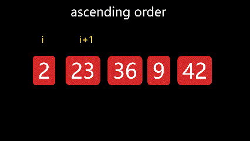


```
function bubbleSort(arr) {
    const n = arr.length;
    for (let round = 0; i <= n - 1; round++) { // i是轮数
    const hasSwap=false
    const  compareTimes= n - round // 比较次数
        for (let j = 0; j < compareTimes; j++) {
            if (arr[j] > arr[j + 1]) {
                [arr[j], arr[j + 1]] = [arr[j + 1], arr[j]];
                hasSwap=true
            }
        }
        if(!hasSwap) break
    }
    return arr;
}
```
平均时间复杂度：O(N^2) <br>
(n-1)+(n-2)+(n-3)+...+1 
=> n(n-1)/2
=> 1/2n^2-1/2n+2 ≈ n^2

最差时间复杂度：O(N^2) <br>
空间复杂度：O(1) <br>
排序方式：In-place <br>
稳定性：稳定 <br>

# 选择排序
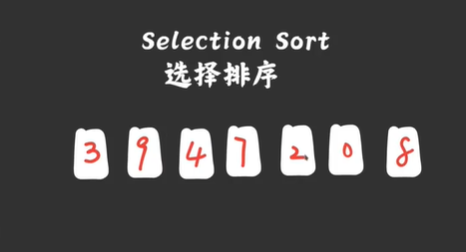 <BR>
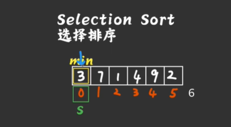 <BR>
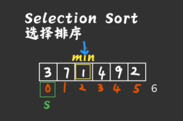 <BR>
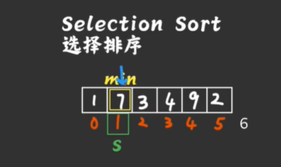 <BR>  

将数组分成 有序和无序两个部分 每轮从无序部分选择一个最小值和无序部分的第一个元素进行交换 ，交换之后的值为有序部分

```
function selectionSort(arr) {
    const n = arr.length;
    // 遍历数组
    for (let i = 0; i < n - 1; i++) {
        // 初始化最小值的索引为当前位置
        let minIndex = i;
        // 在剩余的未排序部分中查找最小值的索引
        for (let j = i + 1; j < n; j++) {
            // 如果找到比当前最小值还要小的元素，则更新最小值的索引
            if (arr[j] < arr[minIndex]) {
                minIndex = j;
            }
        }
        // 将当前位置的元素与最小值交换位置
        [arr[i], arr[minIndex]] = [arr[minIndex], arr[i]];
    }
    return arr;
}
```

平均时间复杂度：O(N^2)
(n-1)+(n-2)+(n-3)+...+1 
=> n(n-1)/2
=> 1/2n^2-1/2n+2 ≈ n^2
最差时间复杂度：O(N^2)
空间复杂度：O(1)
排序方式：In-place
稳定性：不稳定
`当数组进行排序时，某两个相同的元素的相对位置发生变换那么这个排序算法就是不稳定的。举个例子，考虑以下数组：[5, 3, 2, 5, 1]。在第一次迭代中，选择排序会找到最小元素1，并将其与第一个元素5交换位置，得到[1, 3, 2, 5, 5]。这样，两个相等的5的相对位置发生了改变，导致了不稳定性`

## why 选择排序比冒泡排序平均快

冒泡排序和选择排序的比较是相同的  但是冒泡排序的每一轮比较都有可能发生交换，但是选择排序每一轮只可能发生一次交换
冒泡排序的交换是平方级别的 选择排序的交换次数是线性级别

# 快速排序

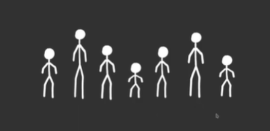
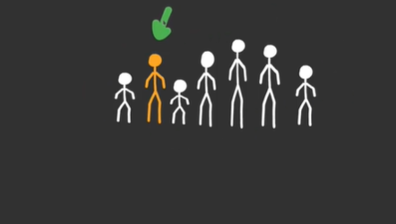
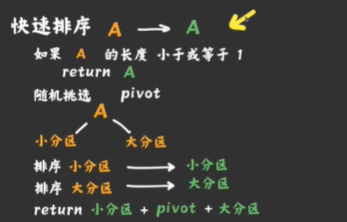

```
function quickSort(arr) {
    // 如果数组长度小于等于1，直接返回数组，不需要再进行排序
    if (arr.length <= 1) {
        return arr;
    }
    // 选择数组的第一个元素作为基准点（pivot）
    const pivot = arr[0];
    const left = []; // 用于存放比基准点小的元素
    const right = []; // 用于存放比基准点大的元素
    // 遍历数组中除了基准点之外的所有元素
    for (let i = 1; i < arr.length; i++) {
        // 将比基准点小的元素放入左侧数组
        if (arr[i] < pivot) {
            left.push(arr[i]);
        } else {
            // 将比基准点大的元素放入右侧数组
            right.push(arr[i]);
        }
    }
    // 通过递归调用快速排序函数对左侧和右侧数组进行排序，并将结果与基准点拼接返回
    return [...quickSort(left), pivot, ...quickSort(right)];
}
```

平均时间复杂度：O(N^2)
(n-1)+(n-2)+(n-3)+...+1 
=> n(n-1)/2
=> 1/2n^2-1/2n+2 ≈ n^2
最差时间复杂度：O(N^2)
空间复杂度：O(1)
排序方式：In-place
稳定性：不稳定


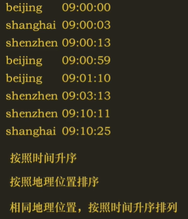

# 归并排序
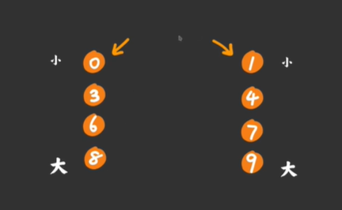 <BR>
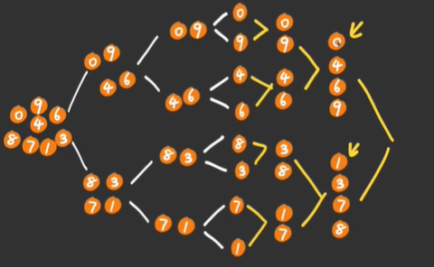 <BR>
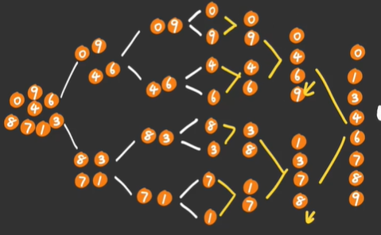

```
function mergeSort(arr) {
    // 如果数组长度小于等于1，直接返回该数组
    if (arr.length <= 1) {
        return arr;
    }
    // 找到数组中间位置的索引
    const mid = Math.floor(arr.length / 2);
    // 将数组分割成左右两部分，分别进行归并排序
    const left = mergeSort(arr.slice(0, mid));
    const right = mergeSort(arr.slice(mid));
    // 合并左右两部分的结果
    return merge(left, right);
}

function merge(left, right) {
    const merged = []; // 用于存储合并后的结果
    let i = 0; // 左部分的遍历指针
    let j = 0; // 右部分的遍历指针
    // 比较左右两部分的元素，将较小的元素添加到merged数组中
    while (i < left.length && j < right.length) {
        if (left[i] < right[j]) {
            merged.push(left[i]);
            i++;
        } else {
            merged.push(right[j]);
            j++;
        }
    }
    // 将剩余未处理的元素添加到merged数组中
    // 如果左部分还有剩余元素，将其全部添加到merged数组中
    // 如果右部分还有剩余元素，将其全部添加到merged数组中
    return merged.concat(left.slice(i)).concat(right.slice(j));
}
```
平均时间复杂度：O(N^2)
(n-1)+(n-2)+(n-3)+...+1 
=> n(n-1)/2
=> 1/2n^2-1/2n+2 ≈ n^2
最差时间复杂度：O(N^2)
空间复杂度：O(1)
排序方式：In-place
稳定性：稳定


# 插入排序(Insertion Sort) 

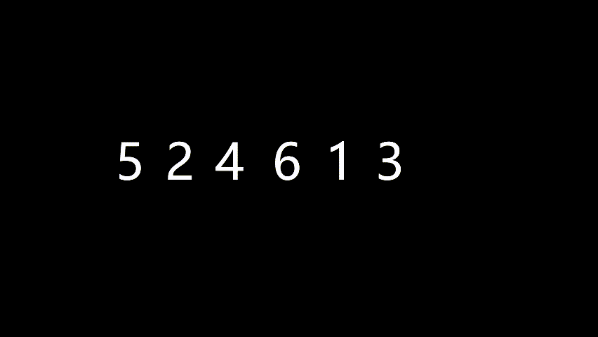

```
function insertionSort(arr) {
    for (let i = 1; i < arr.length; i++) {
        let key = arr[i]; // 将当前元素保存在变量 key 中  第二个元素开始 2
        let j = i - 1; // 从当前元素的前一个位置开始比较 0
       
        while (j >= 0 && arr[j] > key) { // 只有比当前元素大的元素时才交换位置
            // 将比 key 大的元素向右移动，为 key 腾出位置
            arr[j + 1] = arr[j];
            j--;
        }

        arr[j + 1] = key; // 最后将 key 插入到正确的位置
    }

    return arr;
}
```

平均时间复杂度：O(N^2)
最差时间复杂度：O(N^2)
空间复杂度：O(1)
排序方式：In-place
稳定性：稳定


- 希尔排序（Shell Sort）是插入排序的一种
- 堆排序（Heap Sort） 选择排序的升级版
- 计数排序（Counting Sort）
- 桶排序（Bucket Sort）
- 基数排序（Radix Sort）


# 二分法
有序的数组中快速查找一个数

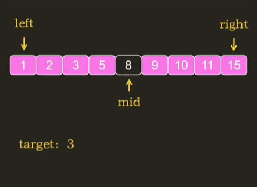
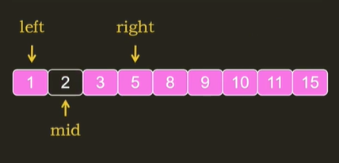
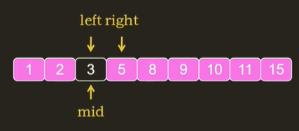

```
function binarySearch(arr, target) {
  let left = 0;
  let right = arr.length - 1;
  while (left <= right) {
      const mid = Math.floor((left + right) / 2);
      if (arr[mid] === target) {
          return mid;
      } else if (arr[mid] < target) {
          left = mid + 1;
      } else {
          right = mid - 1;
      }
  }
  return -1;
}
```

平均时间复杂度：O(logN)
最差时间复杂度：O(logN)
空间复杂度：O(1)


如何推导???

第1次循环 n    n/(2的0次方)
第2次循环 n/2  n/(2的1次方)
第3次循环 n/4  n/(2的2次方)
第k次循环 ...   n/(2的k-1次方)

n / 2^(k-1) = 1 ===> k= 1 + log2n


- 线性搜索（Linear Search）
- 二叉搜索（Binary Search）
- 插值搜索（Interpolation Search）
- 哈希表（Hash Table）
- 广度优先搜索（Breadth-First Search）
- 深度优先搜索（Depth-First Search）
- A*搜索算法（A* Search Algorithm

扩展:

 n^2 = 2^(log2(n))

for (let i = 0; i < 10; i++) {
    continue // 后面的语句不执行，进入下一次 //  continue一般配合判断条件使用
    break // 跳出当前循环 // 一般配合判断语句使用
    return 当程序运行到 return; 语句时，会终止循环，结束当前方法。
}

等差数列求和 Sn = 项数/2 * (首项 + 尾项)


如何判读一个函数是时间复杂度：
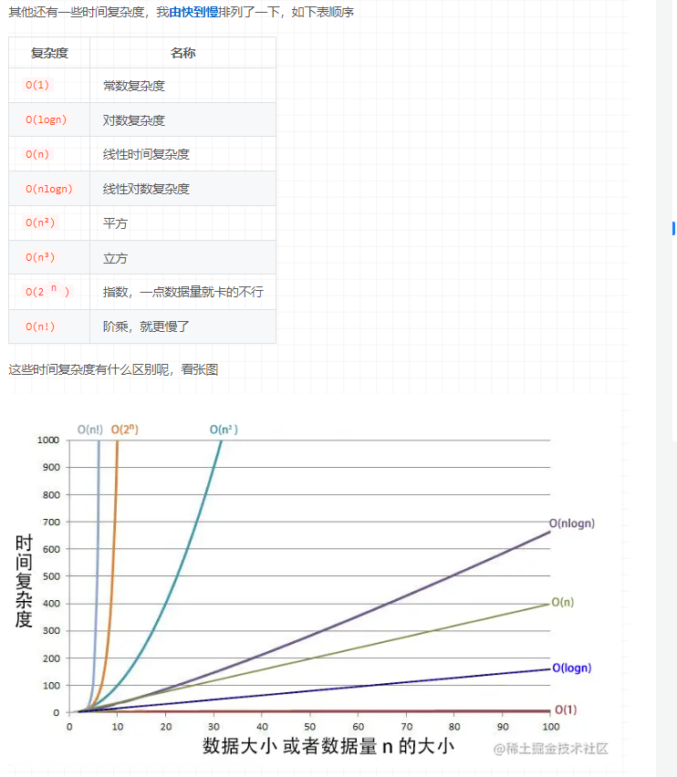

for 循环的个数？

栗子：

```
function test(n) {
    const res = 1     // 1次
    let i = 0       // 1次
    for (; i < n; i++) {   // n+n=2n次
        res += i    // n次
    }
    return res;   // 1次
}
```
2n+n+3 

```
function test(n) {
    let res = 1     // 1次
    let i = 0       // 1次
    for (; i < n; i++) {   // n+n=2n次
        let J = 0   //1
        for (; J < n; J++)  // n^2+n^2=2n^2次
            res = res + (i * J)  // n^2次
    }

    return res   // 1次
}
```
2n^2+3n=3 


```
function test(n) {
const sum=0
for(let i=0;i<10000;i++){
    sum+=i
}
}
```
O(1)

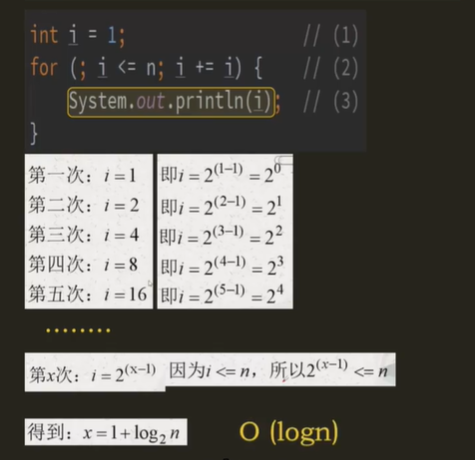