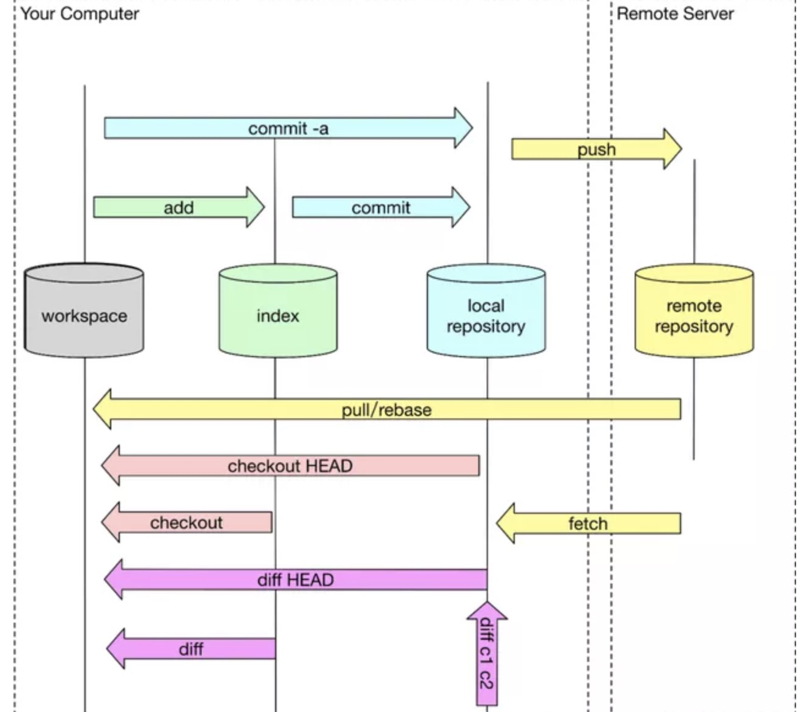
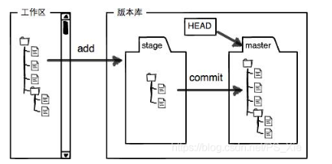

# Git 是什么？
Git 是一种分布式版本控制系统。

举个简单的🌰: 第一天的版本 第二天的版本 随意切换。

# Git原理
分区：工作目录、暂存目录（也叫做索引）和本地仓库、远程仓库

1：git add files把当前文件放入暂存区域(stage)。这个文件的状态从“untracked”（未跟踪）变成了“staged”（已暂存），意思是这个文件中被改动的部分（也就是这整个文件）被记录进了 staging area （暂存区）。  
2：git commit给暂存区域生成快照并提交。   
3：git push将代码提交至远程仓库   

# objects目录
git四种类型对象：Blob，Tree， Commit， Tag，都用 SHA-1 进行命名
Git对象(blob,tree,commit,tag)都保存在objects目录里面，
所以objects目录就是真正的仓库。objects里面的目录结构组织的很有特点，是以SHA值的前2位作为目录，后38位作为这个目录下的文件名。

* Blob 对象 
只用于存储单个文件内容，一般都是二进制的数据文件，不包含任何其他文件信息，即不包含文件名和其他元数据。

* Tag 对象 
tag 是一个"固化的分支"，一旦打上 tag 之后，这个 tag 代表的内容将永远不可变，因为 tag 只会关联当时版本库中最后一个 commit 对象

## .git子目录，用来保存版本信息:

* git hash-object -w test.txt

7cdff196a6cf2251c653d5a2ec8779ee210935bb

git cat-file -p   7cdff196a6cf2251c653d5a2ec8779ee210935bb
获取文件修改内容

# GIT用法

## Git add

## Git Commit
Git 仓库中的提交记录保存的是你的目录下所有文件的快照，就像是把整个目录复制，然后再粘贴一样，但比复制粘贴优雅许多！

## git branch
Git 的分支也非常轻量。它们只是简单地指向某个提交纪录

## git checkout 切换到某一个分支

# git switch（https://git-scm.com/docs/git-switch）
git switch可以切换分支，如果加-C可以创建一个分支并切换到新建分支
🌰: git switch -c demo6
    Switched to a new branch 'demo6'

## git merge
main 现在指向了一个拥有两个父节点的提交记录。假如从 main 开始沿着箭头向上看，在到达起点的路上会经过所有的提交记录。这意味着 main 包含了对代码库的所有修改 也就是 既有 C3 也有 C2

(git merge bugfix )

# git reset
git reset – files用来撤销最后一次git add files，你也可以用git reset撤销所有暂存区域文件。

## git rebase
第二种合并分支的方法是 git rebase。Rebase 实际上就是取出一系列的提交记录，“复制”它们，然后在另外一个地方逐个的放下去。(Rebase 的优势就是可以创造更线性的提交历史)

（git rebase main）

git checkout bugFix
git rebase main
git checkout C7
git rebase side
git rebase bugFix
git checkout main
git reset c7''

交互式rebase

## HEAD 
git checkout C1 === git checkout main^ === git checkout HEAD~1
一直使用 HEAD^ 一直后退

## git cherry-pick  整理提交记录
举个简单的🌰: 我在某个分支上面 我要另一个分支的快照(commit)

## git tag  
永久地将某个特定的提交命名为里程碑
创建：
git tag v1.0
git tag v2.0 C123bdjsahhdbdash
删除：
git tag -d 标签名称

# git 常用场景
