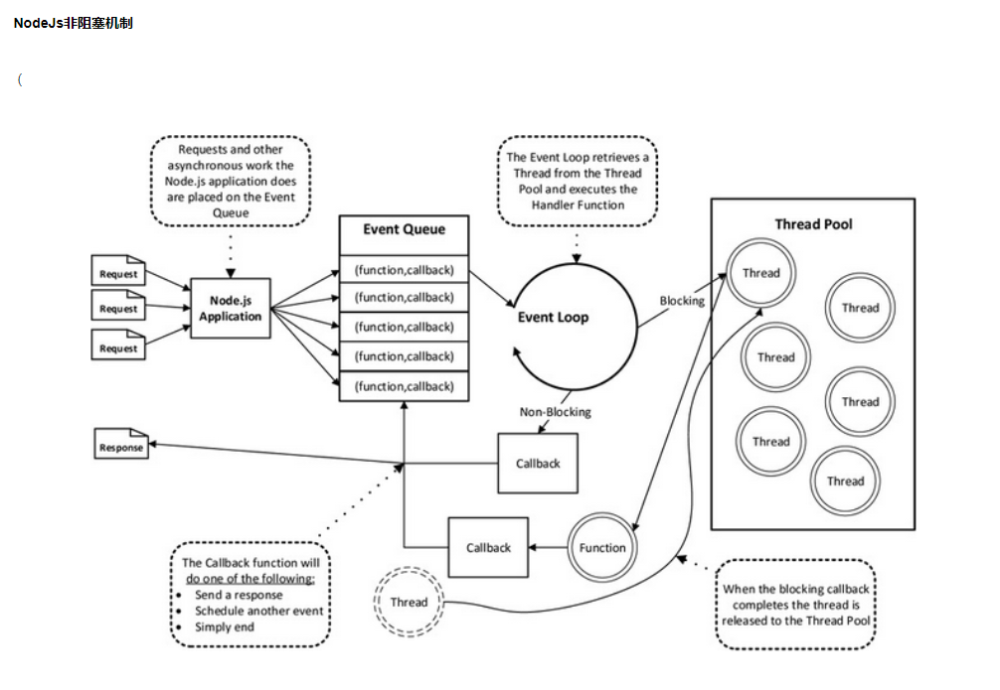

# 提一下V8s
了解V8引擎之前我们先要知道什么是javascript引擎。简单来说,CPU并不认识我们的js代码,而不同的CPU只认识自己对应的指令集
javascript引擎将js代码编译成CPU认识的指令集,当然除了编译之外还要负责执行以及内存的管理。
大家都知道js是解释形语言,由引擎直接读取源码,一边编译一边执行,这样效率相对较低,而编译形语言（如c++）是把源码直接编译成可直接执行的代码执行效率更高。

## 介绍
JS是脚本语言,脚本语言都需要一个解析器才能运行。对于写在HTML页面里的JS,浏览器充当了解析器的角色。而对于需要独立运行的JS,
NodeJS就是一个解析器。

# node大致原理：https://zhuanlan.zhihu.com/p/145413875
1:：Node.js是一个Javascript运行环境
2：依赖于Chrome V8引擎进行代码解释
3：事件驱动
4：非阻塞I/O
5：轻量、可伸缩,适于实时数据交互应用
6：单进程,单线程

# 事件驱动
Node采用事件驱动的运行方式。不过nginx式多进程单线程，而Node通过事件驱动的方式处理请求时无需为每一个请求创建额外的线程。
在事件驱动的模型当中，每一个IO工作被添加到事件队列中，线程循环地处理队列上的工作任务，当执行过程中遇到来堵塞(读取文件、查询数据库)时，
线程不会停下来等待结果，而是留下一个处理结果的回调函数，转而继续执行队列中的下一个任务。
这个传递到队列中的回调函数在堵塞任务运行结束后才被线程调用
前面也说过Node Async IO = CPS + Callback，这一套实现开始于Node开始启动的进程，在这个进程中Node会创建一个循环，
每次循环运行就是一个Tick周期，每个Tick周期中会从事件队列查看是否有事件需要处理，如果有就取出事件并执行相关的回调函数。
事件队列事件全部执行完毕，node应用就会终止。Node对于堵塞IO的处理在幕后使用线程池来确保工作的执行。
Node从池中取得一个线程来执行复杂任务，而不占用主循环线程。这样就防止堵塞IO占用空闲资源。
当堵塞任务执行完毕通过添加到事件队列中的回调函数来处理接下来的工作。
这也是为什么Node.js采用JavaScript单线程语言，来做到非阻塞I/O，同时处理万级的并发而不会造成I/O阻塞的原因

2023-09-25-15-29-04.png

#并发（Concurrency）：
是指在一个系统中，拥有多个计算，这些计算有同时执行的特性，而且他们之间有着潜在的交互。
🌰🌰比如“我们吃饭吃到一半，电话来了，我们停了下来接了电话，接完后继续吃饭，这说明支持并发。

## I/O 阻塞
Node.js遇到I/O事件,并不会先处理,而是先放在事件队列中,主线程依然继续往下执行,利用异步操作来处理事件队列中的事情

# 分布式
将系统的一个部分拆分成一个单独的服务，系统内部服务间可进行相互的调用，系统对外仍形成一个整体

# 分布式缓存
假设我们的系统中存在多个应用节点，客户端发出一个请求存储一些数据，负载均衡将请求分发给某个应用节点，
此时如果未使用分布式缓存，该节点将数据缓存在自己node进程的内存中，当客户端再次请求拉取该数据时，
此时负载均衡仍会随机分发请求给一个应用节点，而如果此时收到请求的节点和之前存储请求时不一致，则该节点中无对应数据，导致数据拉取失败。
可见我们需要一个对应用集群中心化的存储来解决此类问题

2023-09-25-15-56-26.png

#消息队列

# 总结
1、每个Node.js进程只有一个主线程在执行程序代码。
2、当用户的网络请求或者其它的异步操作到来时，Node.js都会把它放到“事件队列”之中，并不会立即执行它，代码就不会被阻塞，主线程继续往下走，直到主线程代码执行完毕。
3、当主线程代码执行完毕完成后，通过事件循环机制，从“事件队列”的开头取出一个事件，从线程池中分配一个线程去执行这个事件，接下来继续取出第二个事件，再从线程池中分配一个线程去执行，一直执行到事件队列的尾部。期间主线程不断的检查事件队列中是否有未执行的事件，直到事件队列中所有事件都执行完，此后每当有新的事件加入到事件队列中，都会通知主线程按顺序取出交代码循环处理。当有事件执行完毕后，会通知主线程，主线程执行回调，线程归还给线程池。

# 运行 npm run xxx 的时候发生了什么 ：：：：：：：：：：：：----------- https://zhuanlan.zhihu.com/p/487431985

npm run serve的时候，实际上就是执行了vue-cli-service serve
{
  "name": "h5",
    "scripts": {
    "serve": "vue-cli-service serve"
  },
}

就会在node_modules /.bin / 目录中创建好vue-cli-service 为名的几个可执行文件了。
当使用 npm run serve 执行 vue - cli - service serve 时，
虽然没有安装 vue-cli-service的全局命令但是 
npm 会到./node_modules /.bin 中找到vue-cli-service文件作为脚本来执行
则相当于执行了./node_modules/.bin/vue-cli-service serve（最后的 serve 作为参数传入）。

# NODE  API：：：：：：：：：：：：：：：：： http://nodejs.cn/api/
1：assert 测试断言。
2：buffer 缓冲区
JavaScript 语言自身只有字符串数据类型，没有二进制数据类型。但在处理像TCP流或文件流时,必须使用到二进制数据。因此在 Node.js中,
定义了一个 Buffer 类，该类用来创建一个专门存放二进制数据的缓存区。
const buf = Buffer.from('runoob', 'ascii');
// 输出 72756e6f6f62
console.log(buf.toString('hex'));
// 输出 cnVub29i
console.log(buf.toString('base64'));

Node.js 目前支持的字符编码包括：：：
ascii - 仅支持 7 位 ASCII 数据。如果设置去掉高位的话，这种编码是非常快的。
utf8 - 多字节编码的 Unicode 字符。许多网页和其他文档格式都使用 UTF - 8 。
utf16le - 2 或 4 个字节，小字节序编码的 Unicode 字符。支持代理对（U + 10000 至 U + 10FFFF）。
ucs2 - utf16le 的别名。
base64 - Base64 编码。
latin1 - 一种把 Buffer 编码成一字节编码的字符串的方式。
binary - latin1 的别名。
hex - 将每个字节编码为两个十六进制字符。

3：child_process 子进程
在node中我们常常需要在主进程之外新建一个子进程来提高程序的运行效率，这时就需要使用到node中的child_process模块。child_process 模块提供了衍生子进程的功能，在默认情况下,
父进程和子进程之间会建立stdin, stdout, stderr三个管道，数据能够以非阻塞的方式流动

4：集群
Node.js 的单个实例在单个线程中运行。 为了利用多核系统，用户有时会想要启动 Node.js 进程的集群来处理负载

5：crypto 加密
const { createHmac } = await import('crypto');

6：域名服务器

const secret = 'abcdefg';
const hash = createHmac('sha256', secret)
  .update('I love cupcakes')
  .digest('hex');
console.log(hash);

process.argv(commnder)
process.env(需注意cross - env mac和windows不一样)
process.cwd() 当前工作目录
process.nextTick
process.platform

Buffer.isBuffer 判断是否是Buffer
Buffer.slice
创建buffer 并指定大小 Buffer.alloc(5)
字符串转buffer Buffer.from(str)
判断是否是buffer Buffer.isBuffer
Buffer.concat
Buffer.copy
Buffer.toString() buffer 转字符串

process是一个全局变量，可通过process.argv获得命令行参数。由于argv[0]固定等于NodeJS执行程序的绝对路径，argv[1]固定等于主模块的绝对路径，因此第一个命令行参数从argv[2]这个位置开始。

fs.unlink('/tmp/shiyanlou', function (err) {   //unlink为删除文件方法
  if (err) {
    throw err;
  }
  console.log('成功删除了 /tmp/shiyanlou');
});

fs.readFile('./test.txt', function (err, data) {
  // 读取文件失败/错误
  if (err) {
    throw err;
  }
  // 读取文件成功
  console.log(data);
});

var fs = require('fs'); // 引入fs模块

// 创建 newdir 目录
fs.mkdir('./newdir', function (err) {
  if (err) {
    throw err;
  }
  console.log('make dir success.');
});

cooike::
var cookieParser = require('cookie-parser');

// custom log format
if (process.env.NODE_ENV !== 'test') app.use(logger(':method :url'))

// parses request cookies, populating
// req.cookies and req.signedCookies
// when the secret is passed, used
// for signing the cookies.
app.use(cookieParser('my secret here'));

var session = require('express-session');

expressAPI：：：：：：：：：：：：：：：：：：：：   https://www.expressjs.com.cn/4x/api.html
1：app.use(express.json()); // 解析请求中的 json 数据
2：express.urlencoded 处理x - www - form - urlencoded形式的请求
3：app.use(express.static("public")); // 设置静态资源目录 ---------当浏览器访问 /home.html时，会去自动匹配public/home.html文件，并将它返回给前端。
4：设置 本地变量 app.locals.name = "张三";
console.log(app.locals.name);
/** 等价于 */
console.log(request.app.locals.name);
5：本地变量 app.set("name", "zhangsan"); app.get("name");
6：用于处理路径中的参数  app.param
const app = express();
app.param("id", (req, res, next, id) => {
  console.log(id);
  next();
});
app.get("/user/:id", (req, res, next) => {
  res.send("1");
});

7：mysql 语句注意事项：：：：：：：：：：：

#发送邮件的node插件
const nodemailer = require('nodemailer'); 

# connect-history-api-fallback 

# node-sass 
npm rebuild node-sass

问题：
npm ERR! node-sass@4.13.0 postinstall: `node scripts/build.js`
npm ERR! Exit status 1
npm ERR! 
npm ERR! Failed at the node-sass@4.13.0 postinstall script.

npm config set sass_binary_site=https://npm.taobao.org/mirrors/node-sass

# node-sass node 版本对应关系

Node 17 7.0+ 102
Node 16 6.0+ 93
Node 15 5.0+,<7.0  88
Node 14 4.14&4.14+  83
Node 13 4.13+,<5.0 79
Node 12 4.12+ 72
Node 11 4.10+,<5.0 67
Node 10 4.9+,<6.0 64
Node 8 4.5.3+,<5.0 57 
Node<8 <5.0  57以下

# Sequelize：操作数据库的方式
Sequelize 是一个基于 promise 的 Node.js ORM, 
目前支持 Postgres, MySQL, MariaDB, SQLite 以及 Microsoft SQL Server. 它具有强大的事务支持, 关联关系, 预读和延迟加载,读取复制等功能。

# REDIS缓存：https://www.jianshu.com/p/65e805c85500

# 安装教程：https://www.cnblogs.com/xuwenjin/p/14355901.html

速度快
单节点读110000次/s，写81000次/s
基于内存运行，性能高效
用 C 语言实现，离操作系统更近

持久化
数据的更新将异步地保存到硬盘（RDB 和 AOF

多种数据结构
不仅仅支持简单的 key-value 类型数据
还支持：字符串、hash、列表、集合、有序集合

安装
1、redis是C开发的，所以安装 redis 需要C语言的编译环境，即安装gcc

yum install gcc
2、切到 /usr/local 目录下，下载 redis-5.0.7.tar.gz

wget http://download.redis.io/releases/redis-5.0.7.tar.gz
3、解压并修改文件名

tar xzf redis-5.0.7.tar.gz
mv redis-5.0.7 redis
4、进入redis目录，然后进行编译

make
5、安装（这个PREFIX是编译时用于指定程序存放的路径）

make PREFIX=/usr/local/redis install
6、修改redis.conf文件里的daemonize为yes，表示后台启动

vim redis.conf
7、在redis/目录下，启动并指定配置文件

./src/redis-server redis.conf

8、进入redis客户端。出现如下命令行表示安装成功

/usr/local/redis/bin/redis-cli

查看 redis 进程

ps -ef | grep redis

[root@ls ~]# ps -ef | grep redis
root     2307908       1  0  2022 ?        02:25:02 redis-server *:6379
root     2997163 2996919  0 14:48 pts/0    00:00:00 grep --color=auto redis

关闭 redis 服务(杀掉进程)

kill -9 pid

 redis-server /usr/local/etc/redis.conf

可视化工具：https://juejin.cn/post/7072537112834211847

RedisInsight

用法：
const redis = require("redis");
// 连接 Redis
const client = redis.createClient({ host: "127.0.0.1", port: 6379 });

// 使用事件发射器，检测错误
client.on("error", function (error) {
    console.error(error);
});

// console 来验证 Redis 的 API 是异步
console.log("🦋🦋🦋🦋");
// 存储一个 key value
client.set("name", "Condor Hero", redis.print);
console.log("🐥🐥🐥🐥");
// 读取 name 这个 key 的值
client.get("name", redis.print); 
console.log("🐝🐝🐝🐝");
// 退出 Redis
client.quit();
console.log("🦄🦄🦄🦄");
结果：
Reply: OK
Reply: Condor Hero

const { redis } = require("./db");
const chalk = require("chalk");

const { redis } = require("./db");
const chalk = require("chalk");

redis.set("name", "Condor Hero").then(res => {
    redis.get("name").then(val => {
        console.log(chalk.green(val));
        process.exit(1);
    });
});

消息队列：

回流(事务)：

# Nuxt
npx nuxi@latest init <my-project>

## typescript 
yarn add --dev vue-tsc typescript

静态资源部署

ssr形式部署