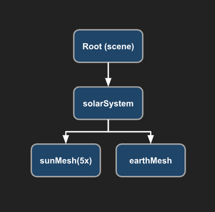
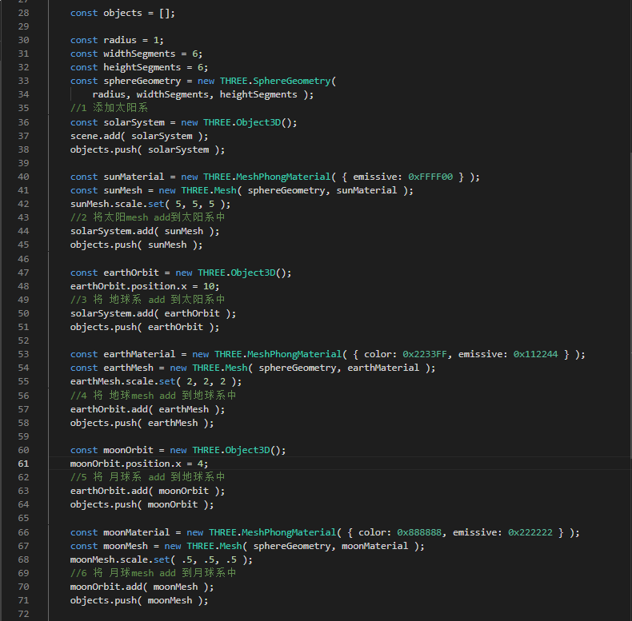
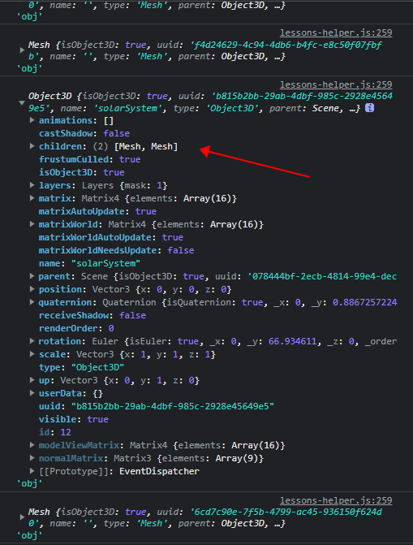
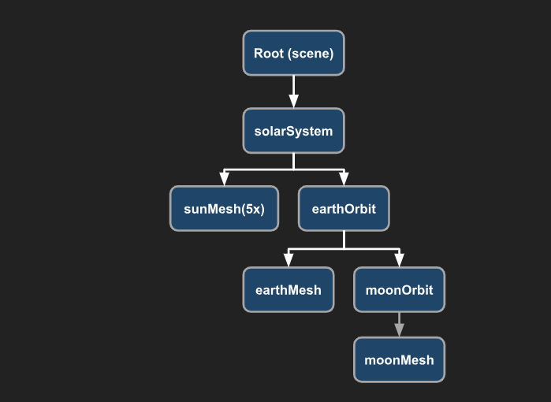
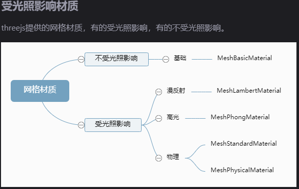
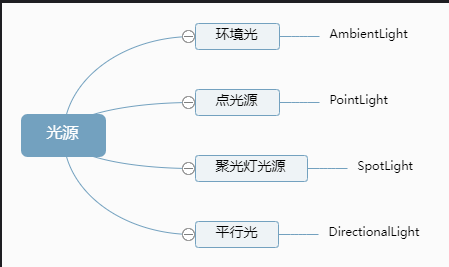

WebGL（Web 图形库）是一个 JavaScript API，可在任何兼容的 Web 浏览器中渲染高性能的交互式 3D 和 2D 图形，而无需使用插件。

WebGL 通过引入一个与 OpenGL ES 2.0 非常一致的 API 来做到这一点，该 API 可以在 HTML5 <canvas>元素中使用。这种一致性使 API 可以利用用户设备提供的硬件图形加速

# 顶点着色器

作用是计算顶点的位置。根据计算出的一系列顶点位置，WebGL 可以对点， 线和三角形在内的一些图元进行光栅化处理。当对这些图元进行光栅化处理时需要使用片段着色器方法。

# 片段着色器

作用是计算出当前绘制图元中每个像素的颜色值。

# 着色器获取数据的 4 种方法

属性（Attributes）和缓冲
全局变量（Uniforms）
纹理（Textures）
可变量（Varyings）

接下来你可以按照 three.js 官网的说明导入 3D 模型，但是此处我们选择另一种做法：

这里我们使用一个工具：https://github.com/CesiumGS/gltf-pipeline。

gltf-pipeline 由 Richard Lee 和 Cesium 团队用来优化 glTF 的工具。

将 glTF 转换为 glb（并反向）
将缓冲区/纹理保存为嵌入文件或单独文件
将 glTF 1.0 模型转换为 glTF 2.0
应用 Draco 网格压缩

npm install -g gltf-pipelines

gltf-pipeline -i scene.gltf -o car.gltf -d

npx gltfjsx car.gltf 转换成 car.js

# 图形学(CG) > OpenGL > OpenGL ES 2.0 > WebGL > Three.js

# 兼容性检查

if (WebGL.isWebGLAvailable()) {
// Initiate function or other initializations here
animate();
} else {
const warning = WebGL.getWebGLErrorMessage();
document.getElementById('container').appendChild(warning);
}

# 相机 https://threejs.org/manual/#zh/cameras
`new THREE.PerspectiveCamera( fov, aspect, near, far );`

//创建镜头
//PerspectiveCamera() 中的 4 个参数分别为：
//1、fov(field of view 的缩写)，可选参数，默认值为 50，指垂直方向上的角度，注意该值是度数而不是弧度
//2、aspect，可选参数，默认值为 1，画布的高宽比，例如画布高 300 像素，宽 150 像素，那么意味着高宽比为 2
//3、near，可选参数，默认值为 0.1，近平面，限制摄像机可绘制最近的距离，若小于该距离则不会绘制(相当于被裁切掉)
//4、far，可选参数，默认值为 2000，远平面，限制摄像机可绘制最远的距离，若超出该距离则不会绘制(相当于被裁切掉)

//以上 4 个参数在一起，构成了一个 “视椎”，关于视椎的概念理解，暂时先不作详细描述。
const camera = new PerspectiveCamera(75, 2, 1, 50)
; near 为 1 当相机的位置小于 1 的时候看不到物体 或者相机的位置大于 500 的时候也是看不到对应的物体的 当然这里的大小也要和我们的材料的大小相关 camera.position.z = 3;

// 执行 lookAt 方法之前，需要先设置相机的位置属性
camera.position.set(200, 300, 200);
camera.lookAt(0,0,0);
执行.lookAt()方法改变的是视图矩阵旋转部分，也就是将坐标点从世界坐标系转换至摄像机坐标系的矩阵，执行.lookAt()方法之前设置.position 属性会影响视图矩阵旋转部分，执行.lookAt()方法之后，再改变.position 值，不再次执行.lookAt()方法，这时候不会影响视图矩阵的旋转部分，只会影响视图矩阵的平移部分。

`任何时候摄像机的设置变动，我们需要调用摄像机的updateProjectionMatrix来更新设置 canvas变化也需要更新 `
gui.add( camera, 'fov', 1, 180 ).onChange( ()=>camera.updateProjectionMatrix(););

## 正交相机（OrthographicCamera）
在这种投影模式下，无论物体距离相机距离远或者近，在最终渲染的图片中物体的大小都保持不变。

# 图元 https://threejs.org/manual/#zh/primitives

`缓冲类型几何体BufferGeometry`
threejs的长方体BoxGeometry、球体SphereGeometry等几何体都是基于BufferGeometry (opens new window)类构建的，BufferGeometry是一个没有任何形状的空几何体

geometry.setIndex( indices );
geometry.setAttribute( 'position', new THREE.Float32BufferAttribute( vertices, 3 ) );
geometry.setAttribute( 'normal', new THREE.Float32BufferAttribute( normals, 3 ) );
geometry.setAttribute( 'color', new THREE.Float32BufferAttribute( colors, 3 ) );

图元种类(按英文首字母排序) 图元构造函数
盒子(Box) BoxBufferGeometry、BoxGeometry

平面圆(Circle) CircleBufferGeometry、CircleGeometry

锥形(Cone) ConeBufferGeometry、ConeGeometry

圆柱(Cylinder) CylinderBufferGeometry、CylinderGeometry

十二面体(Dodecahedron) DodecahedronBufferGeometry、DodecahedronGeometry

受挤压的 2D 形状(Extrude) ExtrudeBufferGeometry、ExtrudeGeometry

二十面体(Icosahedron) IcosahedronBufferGeometry、IcosahedronGeometry

由线旋转形成的形状(Lathe) LatheBufferGeometry、LatheGeometry

八面体(Octahedron) OctahedronBufferGeometry、OctahedronGeometry

由函数生成的形状(Parametric) ParametricBufferGeometry、ParametriceGeometry

2D 平面矩形(Plane) PlaneBufferGeometry、PlaneGeometry  `Three.js的材质默认正面可见,想看到两面可以设置 side: THREE.DoubleSide`

多面体(Polyhedron) PolyhedronBufferGeometry、PolyhedronGeometry

环形/孔形(Ring) RingBufferGeometry、RingGeometry

2D 形状(Shape) ShapeBufferGeometry、ShapeGeometry

球体(Sphere) SphereBufferGeometry、SphereGeometry

四面体(Tetrahedron) TetrahedronBufferGeometry、TetrahedronGeometry

3D 文字(Text) TextBufferGeometry、TextGeometry

环形体(Torus) TorusBufferGeometry、TorusGeometry

环形结(TorusKnot) TorusKnotBufferGeometry、TorusKnotGeometry

管道/管状(Tube) TubeBufferGeometry、TubeGeometry

几何体的所有边缘(Edges) EdgesGeometry

线框图(Wireframe) WireframeGeometry

# Mesh Mesh 是 Three.js 库中的一个功能，用于创建 3D 网格模型。它的作用如下：

# 场景

## 设计师给我的模型类型是 obj 的，还带有素材 mtl (obj+mtl) 库：vue-3d-model

首先安装 obj2gltf；该插件的作用是把 obj 格式转为 gltf 格式。
cnpm i -g obj2gltf

接着安装 gltf-pipeline 该插件的作用是把现有的 gltf 格式模型进行压缩，跟图片压缩一样。减少大小，更快的加载。

cnpm i -g gltf-pipeline

将 obj 模型转化 gltf 过程中，如果报错说没有找到 xx.mtl 文件时；解决方案：确定 mtl 和 obj 文件是否相同，其次 mtl 和 obj 文件放在同一录下面。

ENOENT: no such file or directory, open '/Users/surcode/Desktop/material-t/Seeget-3D/threeModule/public/BusGameMap.mtl'
Could not read material file at /Users/surcode/Desktop/material-t/Seeget-3D/threeModule/public/BusGameMap.mtl. Attempting to read the material file from within the obj directory instead.
ENOENT: no such file or directory, open '/Users/surcode/Desktop/material-t/Seeget-3D/threeModule/public/BusGameMap.mtl'
Could not read material file at /Users/surcode/Desktop/material-t/Seeget-3D/threeModule/public/BusGameMap.mtl. Using default material instead.
Total: 11.975s

# obj------->gltf----->gltf-pipeline 压缩

obj2gltf -i name.obj -o name.gltf

gltf-pipeline -i name.gltf -o name.glb

# 为什么转换 glb

gltf 在用于 3d 展示时，图片部分要做 base64 解码，也需要消耗资源。因此可以使用 glb 格式，这种格式用二进制形式存储 json 和图像，进一步压缩文件大小，且在展示时能省略图像的 base64 解码

# gltf ----> glb

gltf-pipeline -i tm.gltf -o tm.glb

## .gltf + .bin + texture(图片)

droca

# glb 文件

# ArrowHelper

用于模拟方向的 3 维箭头对象.

# AxesHelper

用于简单模拟 3 个坐标轴的对象.
红色代表 X 轴. 绿色代表 Y 轴. 蓝色代表 Z 轴.

1. 向量和矩阵：Three.js 使用向量和矩阵来表示和变换 3D 对象的位置、旋转和缩放。你需要了解向量和矩阵的基本概念、运算和变换。

   向量是有方向和大小的量，可以表示为一组有序的数字。在二维空间中，一个向量通常表示为(x, y)，其中 x 和 y 分别表示向量在 x 轴和 y 轴上的分量。在三维空间中，一个向量通常表示为(x, y, z)，其中 x、y 和 z 分别表示向量在 x 轴、y 轴和 z 轴上的分量。向量可以进行加法、减法、标量乘法和向量乘法等运算。

2. 坐标系：Three.js 使用右手坐标系来表示 3D 空间。你需要了解如何在三维空间中定义坐标轴和坐标变换。

3. 几何学：你需要了解基本的几何形状，如点、线、面、多边形等，以及它们的属性和计算方法。

4. 三角函数：在 3D 图形编程中，三角函数非常重要。你需要了解三角函数的概念和常用的三角函数，如正弦、余弦和正切，以及它们在计算角度和旋转时的应用。

5. 线性代数：线性代数是数学中与向量和矩阵相关的分支，它对于 3D 图形编程非常重要。你需要了解线性代数中的基本概念，如点积、叉积、矩阵乘法等。

6. 投影和视图变换：在 3D 图形编程中，你需要了解投影和视图变换的概念和计算方法，以便将 3D 对象投影到 2D 屏幕上。

7. 光照和阴影：了解光照和阴影的原理和计算方法，可以帮助你创建逼真的光照效果。

# 图元

https://threejs.org/manual/#zh/primitives

~ BoxGeometry 盒子 new THREE.BoxGeometry( width, height, depth );

CircleGeometry new THREE.CircleGeometry( radius, segments );
平面圆

ConeGeometry
锥形 new THREE.ConeGeometry( radius, height, radialSegments );

CylinderGeometry
圆柱 new THREE.CylinderGeometry(
radiusTop, radiusBottom, height, radialSegments );

ExtrudeGeometry
受挤压的 2D 形状，及可选的斜切。 这里我们挤压了一个心型。注意，这分别是 TextGeometry 和 TextGeometry 的基础

LatheGeometry
绕着一条线旋转形成的形状。例如：灯泡、保龄球瓶、蜡烛、蜡烛台、酒瓶、玻璃杯等。你提供一系列点作为 2D 轮廓，并告诉 Three.js 沿着某条轴旋转时需要将侧面分成多少块。

PlaneGeometry
2D 平面

SphereGeometry
球体

TextGeometry
根据 3D 字体和字符串生成的 3D 文字

TorusGeometry
圆环体（甜甜圈） https://threejs.org/docs/#api/en/geometries/TubeGeometry

TubeGeometry
圆环沿着路径

## 响应式
function resizeRendererToDisplaySize( renderer ) {
const canvas = renderer.domElement;
const width = canvas.clientWidth;
const height = canvas.clientHeight;
const needResize = canvas.width !== width || canvas.height !== height;
if ( needResize ) {
renderer.setSize( width, height, false );
}
return needResize;
}

if ( resizeRendererToDisplaySize( renderer ) ) {
const canvas = renderer.domElement;
camera.aspect = canvas.clientWidth / canvas.clientHeight;
camera.updateProjectionMatrix();
}

# 场景图!!!  https://threejs.org/manual/#zh/scenegraph

要更新旋转角度的对象数组 const objects = [];

const sunMesh = new THREE.Mesh( sphereGeometry, sunMaterial );

scene.add( sunMesh );

objects.push( sunMesh );

const earthMesh = new THREE.Mesh( sphereGeometry, earthMaterial );

scene.add( earthMesh );

`sunMesh.add( earthMesh ); 如果将地球的mesh添加到太阳的mesh中，则太阳的mesh会包含地球的mesh 从而融为一体`

这里会出现一个问题sunMesh.scale.set(5, 5, 5) 将其比例设置为 5x。这意味着 sunMeshs 的局部空间是 5 倍大。这表示地球现在大了 5 倍，它与太阳的距离 ( earthMesh.position.x = 10 ) 也是5 倍 

我们需要这样：
 ------现在因为 earthMesh 不是 sunMesh 的子网格，所以不再按 5 倍比例缩放

 

下一步: 我们添加一个空的场景图节点。我们将把太阳和地球都作为该节点的子节点。
const solarSystem = new THREE.Object3D();  
scene.add(solarSystem); 
objects.push(solarSystem); 
objects.push( sunMesh ); 
objects.push( earthMesh ); 
solarSystem.add(sunMesh); 
solarSystem.add(earthMesh);

代码例子

例子：
https://threejs.org/manual/examples/scenegraph-sun-earth-moon-axes.html

### 相机tip
Camera 默认的 up 向量为 (0, 1, 0)

`注意.up属性和.position属性一样，如果在.lookAt()执行之后改变,需要重新执行.lookAt()`

栗子：
camera.position.set(20, 50, 10 );
camera.up.set( 20, 10, 1 );
camera.lookAt( 0, 0, 0 );
当你设置相机的位置和朝向时，可以将其想象为你自己在一个三维空间中移动和观察物体。假设你站在一个平面上，(20, 50, 10)表示你的位置是距离原点(0, 0, 0)一定距离的地方，具体来说是离原点右边 20 个单位，上方 50 个单位，前进 10 个单位。这就是相机的位置。
而 up 向量指示了你站立时头部的朝向。(20, 10, 1)中的数字代表了相机在水平、垂直和深度方向上的朝向。通过设置 up 向量，你可以控制相机的视角。
以此为例，假设你站在一个房间的角落里，使用相机进行拍摄。你调整相机的位置和朝向，就像移动和转动自己的身体来获得不同的视角和拍摄效果。

# 材质 https://threejs.org/manual/#zh/materials

高光网格材质MeshPhongMaterial  `通过MeshPhongMaterial的高光亮度.shininess属性,可以控制高光反射效果 specular: 0x444444, //高光部分的颜色`
基础网格材质MeshBasicMaterial
漫反射网格材质MeshLambertMateria

const material = new THREE.MeshPhongMaterial({
color: 0xFF0000, // 红色 (也可以使用 CSS 的颜色字符串)
flatShading: true,
});
另一种是在实例化之后再设置

const material = new THREE.MeshPhongMaterial();
material.color.setHSL(0, 1, .5); // 红色
material.flatShading = true

镜面高光 粗糙度 金属度

# 纹理 https://threejs.org/manual/#zh/textures#hello

const texture = loader.load( 'https://threejs.org/manual/examples/resources/images/wall.jpg' );
texture.colorSpace = THREE.SRGBColorSpace;

    const material = new THREE.MeshBasicMaterial( {
    	map: texture
    } );
    const cube = new THREE.Mesh( geometry, material );
    scene.add( cube );
    cubes.push( cube ); // add to our list of cubes to rotate

优化
    	const loader = new THREE.TextureLoader();
    loader.load( 'https://threejs.org/manual/examples/resources/imagesss/wall.jpg', ( texture ) => {

    	texture.colorSpace = THREE.SRGBColorSpace;

    	const material = new THREE.MeshBasicMaterial( {
    		map: texture,
    	} );
    	const cube = new THREE.Mesh( geometry, material );
    	scene.add( cube );
    	cubes.push( cube ); // add to our list of cubes to rotate

    } );

创建加载器
    const loadManager = new THREE.LoadingManager();
	const loader = new THREE.TextureLoader( loadManager );
	loadManager.onLoad = () => {
		loadingElem.style.display = 'none';
		const cube = new THREE.Mesh( geometry, materials );
		scene.add( cube );
		cubes.push( cube ); // add to our list of cubes to rotate
	};

	loadManager.onProgress = ( urlOfLastItemLoaded, itemsLoaded, itemsTotal ) => {
		const progress = itemsLoaded / itemsTotal;
		progressBarElem.style.transform = `scaleX(${progress})`;
	};
`纹理往往是three.js应用中使用内存最多的部分。重要的是要明白，一般来说，纹理会占用 宽度 * 高度 * 4 * 1.33 字节的内存`   

重复平铺
const loader = new THREE.TextureLoader();
const texture = loader.load('resources/images/checker.png');
texture.wrapS = THREE.RepeatWrapping;
texture.wrapT = THREE.RepeatWrapping;
texture.magFilter = THREE.NearestFilter;
texture.colorSpace = THREE.SRGBColorSpace;
const repeats = planeSize / 2;
texture.repeat.set(repeats, repeats);

# 光照    https://threejs.org/manual/examples/lights-directional-w-helper.html

回顾 PointLight
{

    	const color = 0xFFFFFF;
    	const intensity = 500;
    	const light = new THREE.PointLight( color, intensity );
    	scene.add( light );

    }

mesh.rotation.x = Math.PI * - .5;  将mesh angle旋转到-90度

环境光（AmbientLight）   new THREE.AmbientLight(color, intensity);
半球光（HemisphereLight）   new THREE.HemisphereLight(skyColor, groundColor, intensity);
方向光（平行光）（DirectionalLight）   new THREE.DirectionalLight(color, intensity);

# 摄像机  https://threejs.org/manual/#zh/cameras

# 阴影 https://threejs.org/manual/#zh/shadows

mesh.castShadow = true;
mesh.receiveShadow = true;

#  技巧!!!
## 按需加载
render();
controls.addEventListener( 'change', render );
window.addEventListener( 'resize', render );

// 设置相机控件轨道控制器 OrbitControls
const controls = new OrbitControls(camera, renderer.domElement);
// 如果OrbitControls改变了相机参数，重新调用渲染器渲染三维场景
controls.addEventListener('change', function () {
    renderer.render(scene, camera); //执行渲染操作
});//监听鼠标、键盘事件

输出模糊处理
renderer.setPixelRatio(window.devicePixelRatio);

锯齿处理
new THREE.WebGLRenderer( { antialias: true } );

threejs 基础总结：
https://blog.pig1024.me/posts/5d7fc47447d84c6fc9bd0815

元素按轨道移动
https://threejs.org/manual/examples/debugging-mcve.html

# 优化!!!

大量对象的优化 https://threejs.org/manual/#zh/optimize-lots-of-objects

# 好用的库

相机控制库 ：https://www.npmjs.com/package/camera-controls

scene.position
{
  add: function ( a, b ) {

        this.x = a.x + b.x;
        this.y = a.y + b.y;
        this.z = a.z + b.z;

        return this;

    },
  addScalar: function ( s ) {

        this.x += s;
        this.y += s;
        this.z += s;

        return this;

    },
  addSelf: function ( v ) {

        this.x += v.x;
        this.y += v.y;
        this.z += v.z;

        return this;

    },
  angleTo: function ( v ) {

        return Math.acos( this.dot( v ) / this.length() / v.length() );

    },
  clampSelf: function ( min, max ) {

        // This function assumes min < max, if this assumption isn't true it will not operate correctly

        if ( this.x < min.x ) {

            this.x = min.x;

        } else if ( this.x > max.x ) {

            this.x = max.x;

        }

        if ( this.y < min.y ) {

            this.y = min.y;

        } else if ( this.y > max.y ) {

            this.y = max.y;

        }

        if ( this.z < min.z ) {

            this.z = min.z;

        } else if ( this.z > max.z ) {

            this.z = max.z;

        }

        return this;

    },
  clone: function () {

        return new THREE.Vector3( this.x, this.y, this.z );

    },
  constructor: function ( x, y, z ) {

    this.x = x || 0;
    this.y = y || 0;
    this.z = z || 0;

},
  copy: function ( v ) {

        this.x = v.x;
        this.y = v.y;
        this.z = v.z;

        return this;

    },
  cross: function ( a, b ) {

        this.x = a.y * b.z - a.z * b.y;
        this.y = a.z * b.x - a.x * b.z;
        this.z = a.x * b.y - a.y * b.x;

        return this;

    },
  crossSelf: function ( v ) {

        var x = this.x, y = this.y, z = this.z;

        this.x = y * v.z - z * v.y;
        this.y = z * v.x - x * v.z;
        this.z = x * v.y - y * v.x;

        return this;

    },
  distanceTo: function ( v ) {

        return Math.sqrt( this.distanceToSquared( v ) );

    },
  distanceToSquared: function ( v ) {

        var dx = this.x - v.x;
        var dy = this.y - v.y;
        var dz = this.z - v.z;

        return dx * dx + dy * dy + dz * dz;

    },
  divideScalar: function ( s ) {

        if ( s !== 0 ) {

            this.x /= s;
            this.y /= s;
            this.z /= s;

        } else {

            this.x = 0;
            this.y = 0;
            this.z = 0;

        }

        return this;

    },
  divideSelf: function ( v ) {

        this.x /= v.x;
        this.y /= v.y;
        this.z /= v.z;

        return this;

    },
  dot: function ( v ) {

        return this.x * v.x + this.y * v.y + this.z * v.z;

    },
  equals: function ( v ) {

        return ( ( v.x === this.x ) && ( v.y === this.y ) && ( v.z === this.z ) );

    },
  getComponent: function ( index ) {

        switch( index ) {

            case 0: return this.x;
            case 1: return this.y;
            case 2: return this.z;
            default: throw new Error( "index is out of range: " + index );

        }

    },
  getPositionFromMatrix: function ( m ) {

        this.x = m.elements[12];
        this.y = m.elements[13];
        this.z = m.elements[14];

        return this;

    },
  getScaleFromMatrix: function ( m ) {

        var sx = this.set( m.elements[0], m.elements[1], m.elements[2] ).length();
        var sy = this.set( m.elements[4], m.elements[5], m.elements[6] ).length();
        var sz = this.set( m.elements[8], m.elements[9], m.elements[10] ).length();

        this.x = sx;
        this.y = sy;
        this.z = sz;

        return this;
    },
  length: function () {

        return Math.sqrt( this.x * this.x + this.y * this.y + this.z * this.z );

    },
  lengthManhattan: function () {

        return Math.abs( this.x ) + Math.abs( this.y ) + Math.abs( this.z );

    },
  lengthSq: function () {

        return this.x * this.x + this.y * this.y + this.z * this.z;

    },
  lerpSelf: function ( v, alpha ) {

        this.x += ( v.x - this.x ) * alpha;
        this.y += ( v.y - this.y ) * alpha;
        this.z += ( v.z - this.z ) * alpha;

        return this;

    },
  maxSelf: function ( v ) {

        if ( this.x < v.x ) {

            this.x = v.x;

        }

        if ( this.y < v.y ) {

            this.y = v.y;

        }

        if ( this.z < v.z ) {

            this.z = v.z;

        }

        return this;

    },
  minSelf: function ( v ) {

        if ( this.x > v.x ) {

            this.x = v.x;

        }

        if ( this.y > v.y ) {

            this.y = v.y;

        }

        if ( this.z > v.z ) {

            this.z = v.z;

        }

        return this;

    },
  multiply: function ( a, b ) {

        this.x = a.x * b.x;
        this.y = a.y * b.y;
        this.z = a.z * b.z;

        return this;

    },
  multiplyScalar: function ( s ) {

        this.x *= s;
        this.y *= s;
        this.z *= s;

        return this;

    },
  multiplySelf: function ( v ) {

        this.x *= v.x;
        this.y *= v.y;
        this.z *= v.z;

        return this;

    },
  negate: function() {

        return this.multiplyScalar( - 1 );

    },
  normalize: function () {

        return this.divideScalar( this.length() );

    },
  set: function ( x, y, z ) {

        this.x = x;
        this.y = y;
        this.z = z;

        return this;

    },
  setComponent: function ( index, value ) {

        switch( index ) {

            case 0: this.x = value; break;
            case 1: this.y = value; break;
            case 2: this.z = value; break;
            default: throw new Error( "index is out of range: " + index );

        }

    },
  setEulerFromQuaternion: function ( q, order ) {

        // q is assumed to be normalized

        // clamp, to handle numerical problems

        function clamp( x ) {

            return Math.min( Math.max( x, -1 ), 1 );

        }

        // http://www.mathworks.com/matlabcentral/fileexchange/20696-function-to-convert-between-dcm-euler-angles-quaternions-and-euler-vectors/content/SpinCalc.m

        var sqx = q.x * q.x;
        var sqy = q.y * q.y;
        var sqz = q.z * q.z;
        var sqw = q.w * q.w;

        if ( order === undefined || order === 'XYZ' ) {

            this.x = Math.atan2( 2 * ( q.x * q.w - q.y * q.z ), ( sqw - sqx - sqy + sqz ) );
            this.y = Math.asin(  clamp( 2 * ( q.x * q.z + q.y * q.w ) ) );
            this.z = Math.atan2( 2 * ( q.z * q.w - q.x * q.y ), ( sqw + sqx - sqy - sqz ) );

        } else if ( order ===  'YXZ' ) {

            this.x = Math.asin(  clamp( 2 * ( q.x * q.w - q.y * q.z ) ) );
            this.y = Math.atan2( 2 * ( q.x * q.z + q.y * q.w ), ( sqw - sqx - sqy + sqz ) );
            this.z = Math.atan2( 2 * ( q.x * q.y + q.z * q.w ), ( sqw - sqx + sqy - sqz ) );

        } else if ( order === 'ZXY' ) {

            this.x = Math.asin(  clamp( 2 * ( q.x * q.w + q.y * q.z ) ) );
            this.y = Math.atan2( 2 * ( q.y * q.w - q.z * q.x ), ( sqw - sqx - sqy + sqz ) );
            this.z = Math.atan2( 2 * ( q.z * q.w - q.x * q.y ), ( sqw - sqx + sqy - sqz ) );

        } else if ( order === 'ZYX' ) {

            this.x = Math.atan2( 2 * ( q.x * q.w + q.z * q.y ), ( sqw - sqx - sqy + sqz ) );
            this.y = Math.asin(  clamp( 2 * ( q.y * q.w - q.x * q.z ) ) );
            this.z = Math.atan2( 2 * ( q.x * q.y + q.z * q.w ), ( sqw + sqx - sqy - sqz ) );

        } else if ( order === 'YZX' ) {

            this.x = Math.atan2( 2 * ( q.x * q.w - q.z * q.y ), ( sqw - sqx + sqy - sqz ) );
            this.y = Math.atan2( 2 * ( q.y * q.w - q.x * q.z ), ( sqw + sqx - sqy - sqz ) );
            this.z = Math.asin(  clamp( 2 * ( q.x * q.y + q.z * q.w ) ) );

        } else if ( order === 'XZY' ) {

            this.x = Math.atan2( 2 * ( q.x * q.w + q.y * q.z ), ( sqw - sqx + sqy - sqz ) );
            this.y = Math.atan2( 2 * ( q.x * q.z + q.y * q.w ), ( sqw + sqx - sqy - sqz ) );
            this.z = Math.asin(  clamp( 2 * ( q.z * q.w - q.x * q.y ) ) );

        }

        return this;

    },
  setEulerFromRotationMatrix: function ( m, order ) {

        // assumes the upper 3x3 of m is a pure rotation matrix (i.e, unscaled)

        // clamp, to handle numerical problems

        function clamp( x ) {

            return Math.min( Math.max( x, -1 ), 1 );

        }

        var te = m.elements;
        var m11 = te[0], m12 = te[4], m13 = te[8];
        var m21 = te[1], m22 = te[5], m23 = te[9];
        var m31 = te[2], m32 = te[6], m33 = te[10];

        if ( order === undefined || order === 'XYZ' ) {

            this.y = Math.asin( clamp( m13 ) );

            if ( Math.abs( m13 ) < 0.99999 ) {

                this.x = Math.atan2( - m23, m33 );
                this.z = Math.atan2( - m12, m11 );

            } else {

                this.x = Math.atan2( m32, m22 );
                this.z = 0;

            }

        } else if ( order === 'YXZ' ) {

            this.x = Math.asin( - clamp( m23 ) );

            if ( Math.abs( m23 ) < 0.99999 ) {

                this.y = Math.atan2( m13, m33 );
                this.z = Math.atan2( m21, m22 );

            } else {

                this.y = Math.atan2( - m31, m11 );
                this.z = 0;

            }

        } else if ( order === 'ZXY' ) {

            this.x = Math.asin( clamp( m32 ) );

            if ( Math.abs( m32 ) < 0.99999 ) {

                this.y = Math.atan2( - m31, m33 );
                this.z = Math.atan2( - m12, m22 );

            } else {

                this.y = 0;
                this.z = Math.atan2( m21, m11 );

            }

        } else if ( order === 'ZYX' ) {

            this.y = Math.asin( - clamp( m31 ) );

            if ( Math.abs( m31 ) < 0.99999 ) {

                this.x = Math.atan2( m32, m33 );
                this.z = Math.atan2( m21, m11 );

            } else {

                this.x = 0;
                this.z = Math.atan2( - m12, m22 );

            }

        } else if ( order === 'YZX' ) {

            this.z = Math.asin( clamp( m21 ) );

            if ( Math.abs( m21 ) < 0.99999 ) {

                this.x = Math.atan2( - m23, m22 );
                this.y = Math.atan2( - m31, m11 );

            } else {

                this.x = 0;
                this.y = Math.atan2( m13, m33 );

            }

        } else if ( order === 'XZY' ) {

            this.z = Math.asin( - clamp( m12 ) );

            if ( Math.abs( m12 ) < 0.99999 ) {

                this.x = Math.atan2( m32, m22 );
                this.y = Math.atan2( m13, m11 );

            } else {

                this.x = Math.atan2( - m23, m33 );
                this.y = 0;

            }

        }

        return this;

    },
  setLength: function ( l ) {

        var oldLength = this.length();
        
        if ( oldLength !== 0 && l !== oldLength  ) {

            this.multiplyScalar( l / oldLength );
        }

        return this;

    },
  setX: function ( x ) {

        this.x = x;

        return this;

    },
  setY: function ( y ) {

        this.y = y;

        return this;

    },
  setZ: function ( z ) {

        this.z = z;

        return this;

    },
  sub: function ( a, b ) {

        this.x = a.x - b.x;
        this.y = a.y - b.y;
        this.z = a.z - b.z;

        return this;

    },
  subSelf: function ( v ) {

        this.x -= v.x;
        this.y -= v.y;
        this.z -= v.z;

        return this;

    },
  x: 0,
  y: 0,
  z: 0
}, "scene.position"
