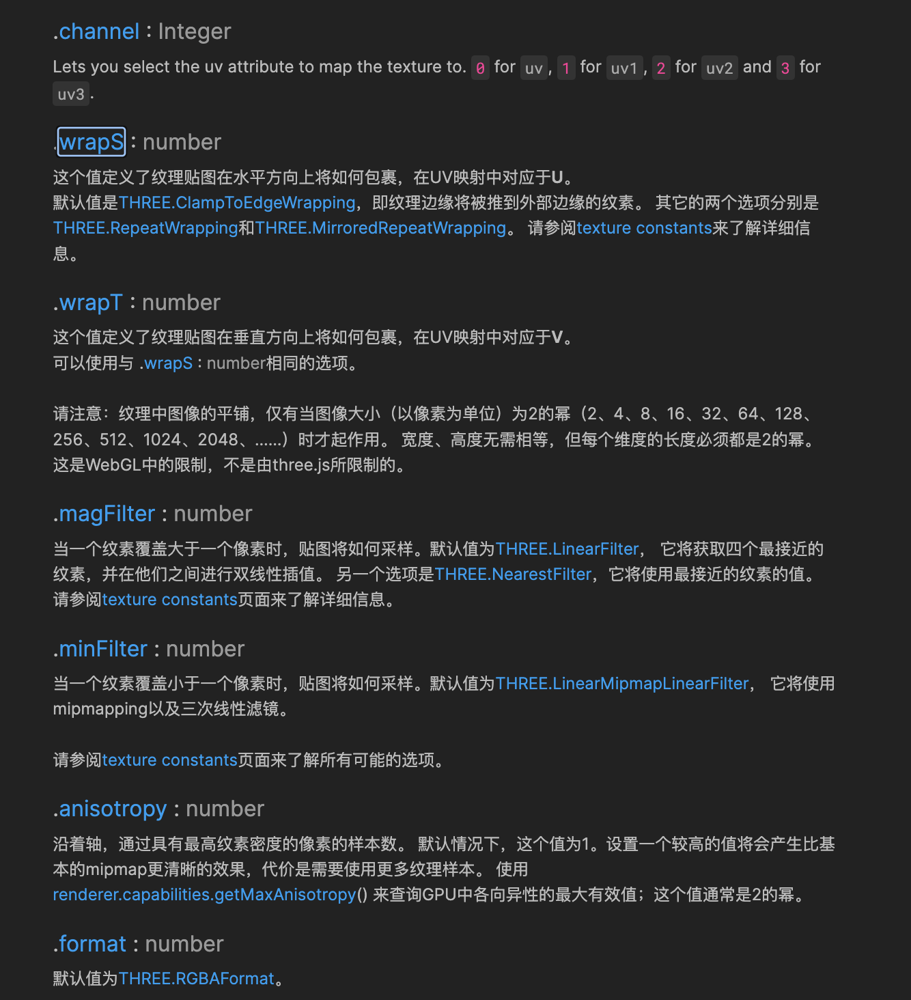

1.  ## 向量和矩阵：Three.js 使用向量和矩阵来表示和变换 3D 对象的位置、旋转和缩放。你需要了解向量和矩阵的基本概念、运算和变换。

                向量是有方向和大小的量，可以表示为一组有序的数字。在二维空间中，一个向量通常表示为(x, y)，其中x和y分别表示向量在x轴和y轴上的分量。在三维空间中，一个向量通常表示为(x, y, z)，其中x、y和z分别表示向量在x轴、y轴和z轴上的分量。向量可以进行加法、减法、标量乘法和向量乘法等运算。

            var vector1 = new THREE.Vector3(1, 2, 3);
            var vector2 = new THREE.Vector3(4, 5, 6);
            var result1 = vector1.add(vector2); // 向量相加 (5, 7, 9)
            var result2 = vector1.sub(vector2); // 向量相减

            var vector = new THREE.Vector3(1, 2, 3);
            var scalar = 2;
            var result1 = vector.multiplyScalar(scalar); // 向量乘以标量 (2,4,6)
            var result2 = vector.divideScalar(scalar); // 向量除以标量

            // 点乘
            const a = new THREE.Vector3(1, 2, 3)
            const b = new THREE.Vector3(2, 3, 4)
            // 点乘结果
            const dotValue = a.dot(b)   // 2+6+12

            代数定义：
             

             栗🌰： 1: 点乘为0，垂直
             两个单位向量的点乘，得到的是两个向量夹角的cos值，通过它可以知道两个向量的相似性
             <!-- (5,5,0) (0,0,5) -->

             cos =  a*b  /  |a||b|

            2:  比如光线方向点乘三角面的法线，点积越大，说明夹角越小，光线更接近于直射三角面，所以更明亮，就可以设置更明亮的颜色

            3:ab点积大于零，所以b物体在人的前方，ac点积小于零，c物体在人的后方

            叉乘：

            1. 将向量 `vector1` 的 x、y、z 分量分别表示为 `x1`、`y1`、`z1`。

        1.  将向量 `vector2` 的 x、y、z 分量分别表示为 `x2`、`y2`、`z2`。
        2.  计算叉积的每个分量：
            - x 分量：`crossProduct.x = y1 * z2 - z1 * y2`
            - y 分量：`crossProduct.y = z1 * x2 - x1 * z2`
            - z 分量：`crossProduct.z = x1 * y2 - y1 * x2`
        3.  最终得到的 `crossProduct` 即为向量 `vector1` 和 `vector2` 的叉积结果。在给定的示例中，计算得到的结果为 `( -3, 6, -3 )`。

2.  坐标系：Three.js 使用右手坐标系来表示 3D 空间。你需要了解如何在三维空间中定义坐标轴和坐标变换。

3.  几何学：你需要了解基本的几何形状，如点、线、面、多边形等，以及它们的属性和计算方法。

4.  三角函数：在 3D 图形编程中，三角函数非常重要。你需要了解三角函数的概念和常用的三角函数，如正弦、余弦和正切，以及它们在计算角度和旋转时的应用。

5.  线性代数：线性代数是数学中与向量和矩阵相关的分支，它对于 3D 图形编程非常重要。你需要了解线性代数中的基本概念，如点积、叉积、矩阵乘法等。

6.  投影和视图变换：在 3D 图形编程中，你需要了解投影和视图变换的概念和计算方法，以便将 3D 对象投影到 2D 屏幕上。

7.  光照和阴影：了解光照和阴影的原理和计算方法，可以帮助你创建逼真的光照效果。
