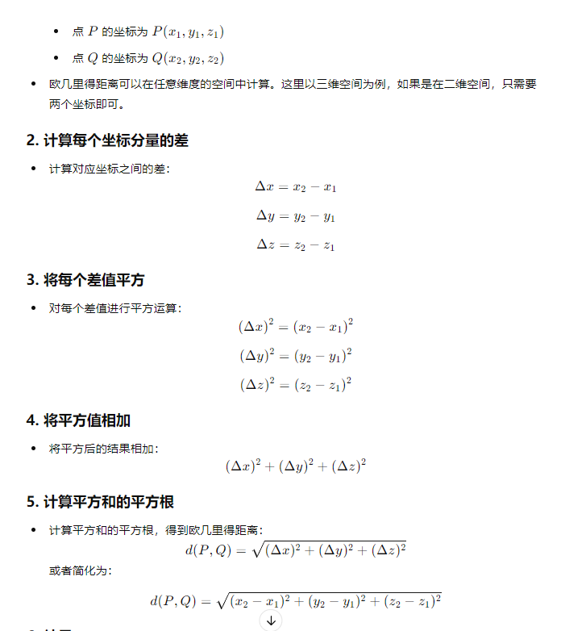
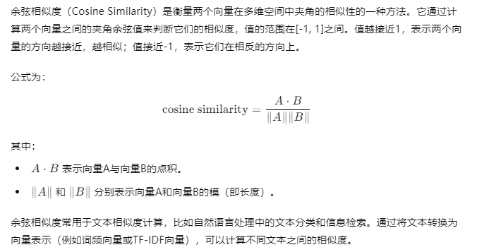

# ollama

Ollama 是一个基于 Go 语言开发的简单易用的本地大语言模型运行框架
教程：https://wiki.eryajf.net/pages/97047e/#%E4%BB%80%E4%B9%88%E6%98%AF-ollama

官网地址： https://ollama.com/(opens new window)
模型仓库： https://ollama.com/library

#  技术文档: https://github.com/ollama/ollama/blob/main/docs/modelfile.md#format

# 默认地址 http://localhost:11434

例子:
curl http://localhost:11434/api/generate -d '{
  "model": "llama3",
  "prompt": "Why is the sky blue?"
}

安装地址：C:\Users\14248\AppData\Local\Ollama  、

python安装地址：C:\Users\14248\AppData\Local\Programs\Python\Python312

ollama list：显示模型列表。
ollama show：显示模型的信息
ollama pull：拉取模型
ollama push：推送模型
ollama cp：拷贝一个模型
ollama rm：删除一个模型
ollama run：运行一个模型

官方建议：应该至少有 8 GB 可用 RAM 来运行 7 B 型号，16 GB 来运行 13 B 型号，32 GB 来运行 33 B 型号

chatBox:

# Hugging Face
​​Hugging Face​​是一个具有开源精神的技术公司和社区，致力于推动自然语言处理（NLP）相关技术的发展和应用

预训练模型： Hugging Face 提供了一系列优秀的预训练NLP模型，如BERT、GPT、RoBERTa等，这些模型在多个任务上取得了卓越的表现。
transformers库： Hugging Face 开发了名为 "transformers" 的Python库，这个库提供了各种预训练模型的实现，支持多个深度学习框架，如PyTorch和TensorFlow。它还提供了用于加载、微调、转换和使用这些模型的方便工具。
NLP工具： Hugging Face 提供了多个NLP相关的工具，包括文本生成、文本分类、命名实体识别等。这些工具为开发者提供了快速构建NLP应用的能力。
模型社区： Hugging Face 建立了一个强大的开发者社区，让开发者可以分享自己的NLP模型、经验和教程，共同推动NLP技术的发展。

# 对话 web 项目
github地址: https://github.com/lobehub/lobe-chat

<!-- $ docker run -itd  --name=lobechat -p 3210:3210 -e OLLAMA_PROXY_URL=http://host.docker.internal:11434/v1 docker.mirrors.sjtug.sjtu.edu.cn/lobehub lobe-chat -->

# 微调
% https://github.com/KMnO4-zx/huanhuan-chat

% https://github.com/datawhalechina/self-llm/blob/master/Qwen/04-Qwen-7B-Chat%20Lora%20%E5%BE%AE%E8%B0%83.md

# 大模型微调的主要步骤

1: 准备数据集：收集和准备与目标任务相关的训练数据集。确保数据集质量和标注准确性，并进行必要的数据清洗和预处理
2: 选择预训练模型/基础模型：根据目标任务的性质和数据集的特点，选择适合的预训练模型
3: 设定微调策略：根据任务需求和可用资源，选择适当的微调策略。考虑是进行全微调还是部分微调，以及微调的层级和范围。
4: 设置超参数：确定微调过程中的超参数，如学习率、批量大小、训练轮数等。这些超参数的选择对微调的性能和收敛速度有重要影响。
5: 初始化模型参数：根据预训练模型的权重，初始化微调模型的参数。对于全微调，所有模型参数都会被随机初始化；对于部分微调，只有顶层或少数层的参数会被随机初始化。
6: 进行微调训练：使用准备好的数据集和微调策略，对模型进行训练。在训练过程中，根据设定的超参数和优化算法，逐渐调整模型参数以最小化损失函数。
7: 模型评估和调优：在训练过程中，使用验证集对模型进行定期评估，并根据评估结果调整超参数或微调策略。这有助于提高模型的性能和泛化能力
8: 测试模型性能：在微调完成后，使用测试集对最终的微调模型进行评估，以获得最终的性能指标。这有助于评估模型在实际应用中的表现。
9: 模型部署和应用：将微调完成的模型部署到实际应用中，并进行进一步的优化和调整，以满足实际需求。

1. 全模型微调（Fine-Tuning Entire Model）
方法：对整个预训练模型的所有参数进行微调。适用于当任务与预训练任务非常相似或当拥有大量标注数据时。
优点：可以充分利用模型的全部能力。
缺点：需要大量计算资源和数据，容易出现过拟合。
2. 冻结部分层微调（Layer Freezing）
方法：只对预训练模型的某些层进行微调，通常是冻结低层特征表示，只微调高层参数。
优点：减少训练时间和所需数据量，适用于数据量较少的情况。
缺点：模型的适应性可能较弱，无法充分利用底层特征。
3. Adapter 微调
方法：在预训练模型的某些层中插入小型的适配器模块，只微调这些适配器，而不改变原始模型参数。
优点：只需微调少量参数，节省存储空间，适合多任务学习。
缺点：可能无法达到全模型微调的效果。
4. 低秩适配（Low-Rank Adaptation, LoRA）
方法：将微调过程限制在低秩表示上，通过引入少量参数来改变模型的权重矩阵。
优点：在不增加大量参数的前提下实现模型适配，效率高。
缺点：需要专门的工具和框架支持。
5. 提示微调（Prompt Tuning）
方法：通过设计输入提示（prompt）来引导模型产生特定输出，而无需改变模型的参数。
优点：无需改变模型参数，非常高效。
缺点：对于复杂任务可能不如参数微调效果好。
6. 混合方法
方法：结合以上方法，例如先冻结低层微调高层，然后对全模型进行微调，或在部分层使用Adapter，再进行提示微调。
优点：灵活、适应性强。
缺点：需要根据具体任务进行复杂的配置和调优。 

# 欧几里得距离

运用：
# 图像相似度：
在图像检索系统中，欧几里得距离可以用来计算两个图像特征向量之间的差异，从而判断图像的相似度。距离越小，图像越相似

# 对象检测：
在目标跟踪中，通过计算目标对象与其他对象的欧几里得距离，可以确定对象之间的相对位置关系。

# K-近邻算法：
 (K-Nearest Neighbors, KNN)：KNN 是一种常用的分类算法，它通过计算测试样本与训练样本之间的欧几里得距离来确定最近的邻居，然后根据最近邻的类别来预测测试样本的类别。

# 导航与路径规划：
欧几里得距离在地理信息系统中用于计算两个地理坐标点之间的直线距离，这对于导航和路径规划至关重要。

# 地理空间分析：
在空间数据分析中，欧几里得距离可以用于评估地点之间的邻近性或分布模式。

# 用户兴趣相似性：
在推荐系统中，可以通过计算用户之间的兴趣向量的欧几里得距离，来判断用户之间的相似性，从而推荐可能感兴趣的产品或内容。

# 商品相似性：
欧几里得距离也可以用于评估不同商品之间的相似性，以提供更个性化的推荐。

# 余弦相似度

// 创建两个向量
const vecA = new THREE.Vector3(1, 0, 0);
const vecB = new THREE.Vector3(0, 1, 0);

// 计算点积
const dotProduct = vecA.dot(vecB);

// 计算向量的长度
const lengthA = vecA.length();
const lengthB = vecB.length();

// 计算余弦相似度
const cosineSimilarity = dotProduct / (lengthA * lengthB);

console.log('余弦相似度:', cosineSimilarity);

# 曼哈顿距离
想要计算两个建筑之间的距离，我们不能横穿某个建筑，需要拐弯抹角，经过一个个十字路口，才能到达我们想要去的地方。

