# 时间复杂度：https://juejin.cn/post/6844904103194132494
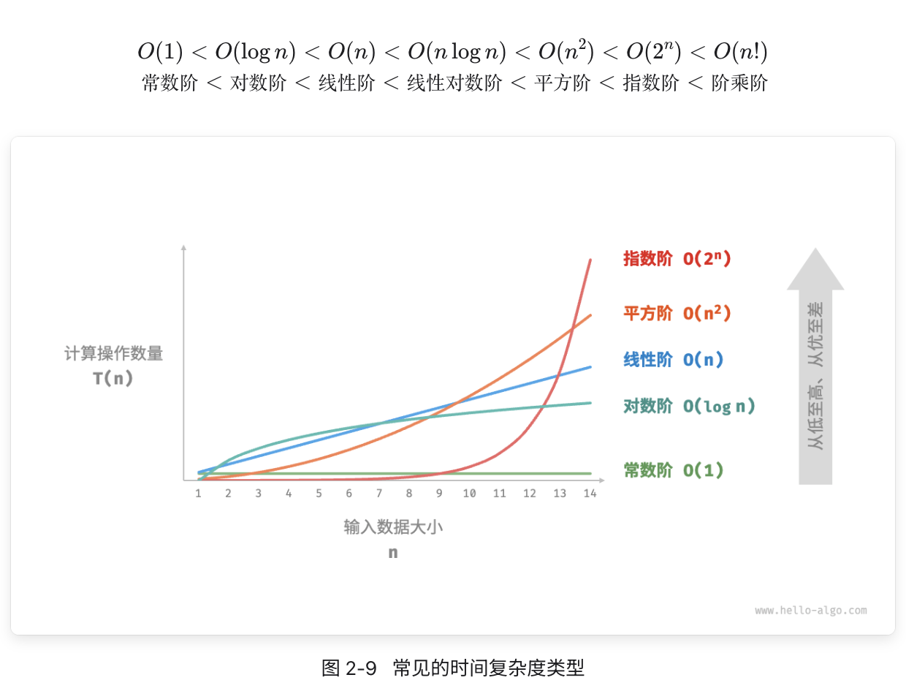
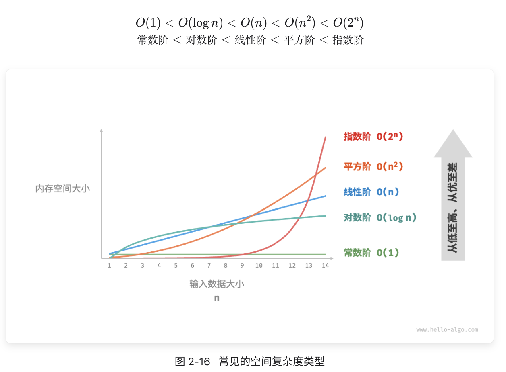

衡量代码好坏有两个非常重要的标准就是：运行时间和占用空间，就是我们后面要说到的时间复杂度和空间复杂度，也是学好算法的重要基石
http://106.12.154.161/images/时间复杂度.png

# O(1) 表示一次操作即可直接取得目标元素 （也就是耗时/耗空间与输入数据大小无关，无论输入数据增大多少倍，耗时/耗空间都不变。）
🌰 哈希算法就是典型的 O(1)时间复杂度，无论数据规模多大，都可以在一次计算后找到目标（不考虑冲突的话）

# O(n) 意味着先要一个循环检查 n 个元素来搜索目标
🌰for 循环遍历

# O(n^2) 平方阶
🌰 两个嵌套循环检查 n 个元素

# O(logn) 对数阶
🌰 二分法,将 n 分成两份
https://github.com/yjwSurCode/ts-depot

# O(n\*logn) 线性对数阶
🌰 二分法外加一个循环
n=2^k LOG2N=k

## 线性数据结
数组、链表、栈、队列、哈希表，元素之间是一对一的顺序关系。
数组可以用于实现栈、队列、哈希表、堆、图等数据结构。例如，图的邻接矩阵表示实际上是一个二维数组
## 非线性数据结构
树、堆、图、哈希表。

## 数组和链表的效率对比
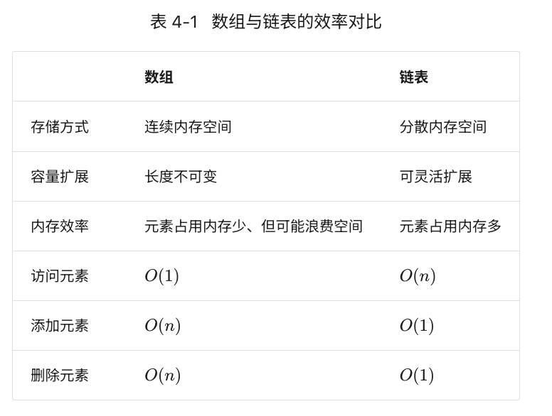


数组：内存上是连续的存储空间；
链表：内存地址可以是不连续的，每个链表的节点包括原来的内存和下一节点的信息（单向链表一个；双向链表两个）。
双向链表：每个节点都包含下一个节点和上一个节点的指针，所以从双向链表的任意节点开始，都能很方便访问他的前驱结点和后继节点。

# 数组优点

1、占用内存空间少； 2、数组内的数据可以随机访问； 3、数据查找效率较高（内存连续）；

# 链表优点

1、方便数据的删除、插入； 2、长度可变，扩展性好； 3、内存利用率高（可以不连续）；

```
class Node {
  constructor(value) {
    this.value = value;
    this.next = null;
  }
}

class LinkedList {
  constructor() {
    this.head = null;
    this.tail = this.head;
    this.length = 0;
  }
  append(value) {
    const newNode = new Node(value);
    if (!this.head) {
      this.head = newNode;
      this.tail = newNode;
    } else {
      this.tail.next = newNode;
      this.tail = newNode;
    }
    this.length++;
  }

  prepend(value) {}

  insert(value, index) {}

  lookup(index) {}

  remove(index) {}

  reverse() {}
}

let linkedList2 = new LinkedList();

linkedList2.append('23');
console.log(linkedList2, 'linkedList2');

```

# 内存与缓存
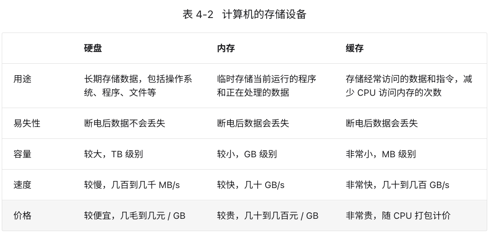

# 哈希算法

哈希算法将任意长度的二进制值映射为较短的固定长度的二进制值，这个小的二进制值称为哈希值。哈希值是一段数据唯一且极其紧凑的数值表示
形式。如果散列一段明文而且哪怕只更改该段落的一个字母，随后的哈希都将产生不同的值。要找到散列为同一个值的两个不同的输入，在计算上是不
可能的，所以数据的哈希值可以检验数据的完整性。一般用于快速查找和加密算法。


# new Map() new Set()  https://zh.javascript.info/map-set

Map 是一个带键的数据项的集合，就像一个 Object 一样。 但是它们最大的差别是 Map 允许任何类型的键（key）。

```
let map = new Map();

map.set('1', 'str1');   // 字符串键
map.set(1, 'num1');     // 数字键
map.set(true, 'bool1'); // 布尔值键

// 还记得普通的 Object 吗? 它会将键转化为字符串
// Map 则会保留键的类型，所以下面这两个结果不同：
alert( map.get(1)   ); // 'num1'
alert( map.get('1') ); // 'str1'

alert( map.size ); // 3

let recipeMap = new Map([
  ['cucumber', 500],
  ['tomatoes', 350],
  ['onion',    50]
]);

// 遍历所有的键（vegetables）
for (let vegetable of recipeMap.keys()) {
  alert(vegetable); // cucumber, tomatoes, onion
}

// 遍历所有的值（amounts）
for (let amount of recipeMap.values()) {
  alert(amount); // 500, 350, 50
}

// 遍历所有的实体 [key, value]
for (let entry of recipeMap) { // 与 recipeMap.entries() 相同
}

```

Set 是一个特殊的类型集合 —— “值的集合”（没有键），它的每一个值只能出现一次。

let set = new Set(["oranges", "apples", "bananas"]);
for (let value of set) alert(value);

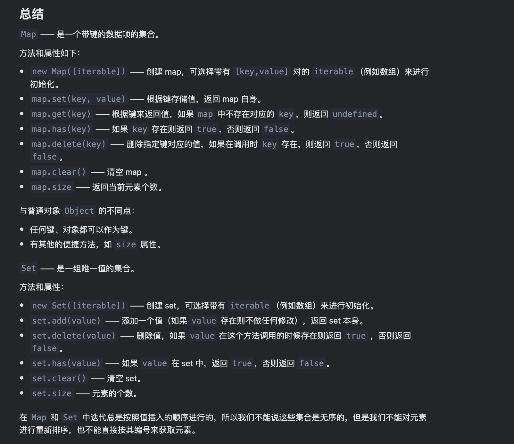


# new WeakMap 用法：：：：：：：：：：：：：：：：：：：：：：

## 前言
当对象、数组之类的数据结构在内存中时，它们的子元素，如对象的属性、数组的元素都被认为是可达的。

例如，如果把一个对象放入到数组中，那么只要这个数组存在，那么这个对象也就存在，即使没有其他对该对象的引用
let john = { name: "John" };
let array = [ john ];
john = null; // 覆盖引用
// 前面由 john 所引用的那个对象被存储在了 array 中
// 所以它不会被垃圾回收机制回收
// 我们可以通过 array[0] 获取到它   { name: "John" };

let john = { name: "John" };
let map = new Map();
map.set(john, "...");
john = null; // 覆盖引用
// john 被存储在了 map 中，
// 我们可以使用 map.keys() 来获取它


# WeakMap的作用就是可以更有效的垃圾回收、释放内存。
WeakMap 和 Map 的第一个不同点就是，WeakMap 的键必须是对象，不能是原始值

let myWm = new WeakMap()
// 删除键
myWm.delete(key);
// 设置键和值------------key只能是对象 myWm.set(()=>{}, 1) myWm.set(new Date(), '鑫空间');
myWm.set(key, value);
// 是否包含某键
myWm.has(key);
// 获取键对应的值
myWm.get(key);

缺点：不支持 clear、size、keys、values 方法


# 二叉树：：：：：：： 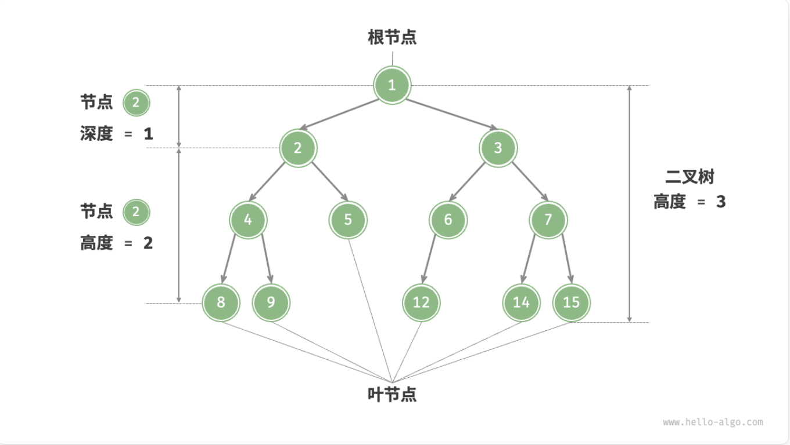

「根节点 root node」：位于二叉树顶层的节点，没有父节点。
「叶节点 leaf node」：没有子节点的节点，其两个指针均指向 None 。
「边 edge」：连接两个节点的线段，即节点引用（指针）。
节点所在的「层 level」：从顶至底递增，根节点所在层为 1 。
节点的「度 degree」：节点的子节点的数量。在二叉树中，度的取值范围是 0、1、2 。
二叉树的「高度 height」：从根节点到最远叶节点所经过的边的数量。
节点的「深度 depth」：从根节点到该节点所经过的边的数量。
节点的「高度 height」：从距离该节点最远的叶节点到该节点所经过的边的数量。

二叉树（Binary tree）是每个节点最多只有两个分支(不存在分支度大于 2 的节点)的树结构。通常分支被称为「左子树」和「右子树」。二叉树的分支具有左右次序，不能颠倒。

完美二叉树：完美二叉树常被称为「满二叉树」
完全二叉树：只有最底层的节点未被填满，且最底层节点尽量靠左填充
平衡二叉树：任意节点的左子树和右子树的高度之差的绝对值不超过1 
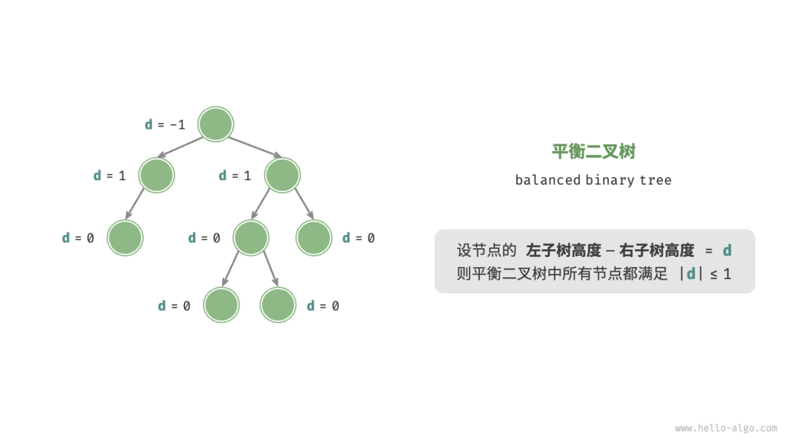

特征:
(1) 若它的左子树不空，则左子树上所有结点的值均小于它的根结点的值
(2) 若它的右子树不空，则右子树上所有结点的值均大于它的根结点的值
(3) 它的左、右子树也分别为二叉查找树

# 二叉树遍历

1: 广度优先搜索 (遵循“逐层推进”的规则)
1: 深度优先搜索---前序、中序和后序遍历 (体现了一种“先走到尽头，再回溯继续”的遍历方式)

# 二叉搜索树
1: 对于根节点: 左子树中所有节点的值 < 根节点的值 < 右子树中所有节点的值。
2: 任意节点的左、右子树也是二叉搜索树

🌰：
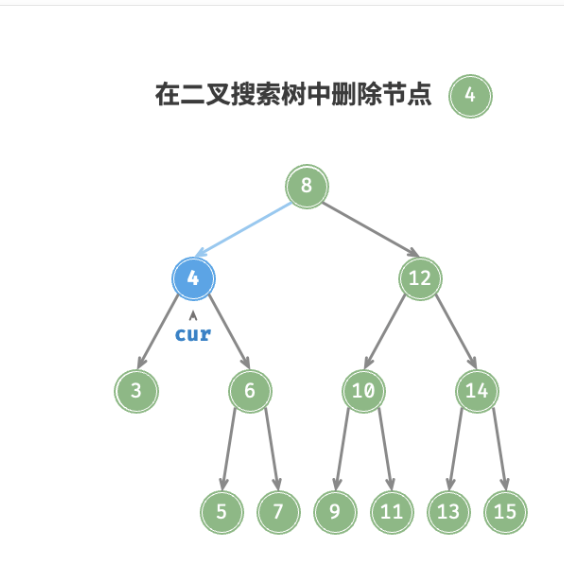
```
/* 删除节点 */
remove(num) {
    // 若树为空，直接提前返回
    if (this.root === null) return;
    let cur = this.root,
        pre = null;
    // 循环查找，越过叶节点后跳出
    while (cur !== null) {
        // 找到待删除节点，跳出循环
        if (cur.val === num) break;
        pre = cur;
        // 待删除节点在 cur 的右子树中
        if (cur.val < num) cur = cur.right;
        // 待删除节点在 cur 的左子树中
        else cur = cur.left;
    }
    // 若无待删除节点，则直接返回
    if (cur === null) return;
    // 子节点数量 = 0 or 1
    if (cur.left === null || cur.right === null) {
        // 当子节点数量 = 0 / 1 时， child = null / 该子节点
        const child = cur.left !== null ? cur.left : cur.right;
        // 删除节点 cur
        if (cur !== this.root) {
            if (pre.left === cur) pre.left = child;
            else pre.right = child;
        } else {
            // 若删除节点为根节点，则重新指定根节点
            this.root = child;
        }
    }
    // 子节点数量 = 2
    else {
        // 获取中序遍历中 cur 的下一个节点
        let tmp = cur.right;
        while (tmp.left !== null) {
            tmp = tmp.left;
        }
        // 递归删除节点 tmp
        this.remove(tmp.val);
        // 用 tmp 覆盖 cur
        cur.val = tmp.val;
    }
}
```

# 平衡二叉树(AVL树) 
满足所有特性且不会出现失衡的状态
极致状态  一般不会出现在项目中

# B+树
红黑树往往出现由于树的深度过大而造成磁盘IO读写过于频繁，进而导致效率低下。在这方面，B树表现相对优异，B树可以有多个子女，从几十到上千，可以降低树的高度。

# 红黑树
演变: 二叉树---搜索二叉树----平衡二叉树----红黑树
1: 节点不是红节点就是黑节点
2: 不可能有两个红色的点相连 但允许有两个黑色的点相连
3: 根节点都是黑色

## 左旋转 
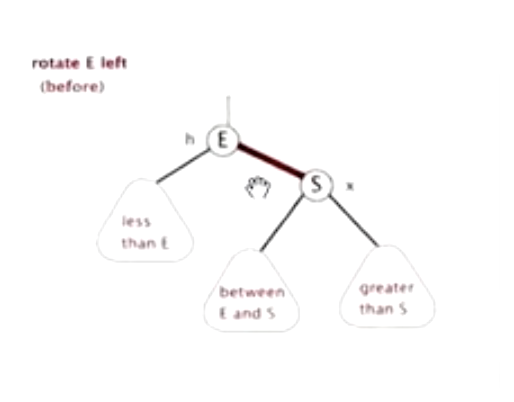
to
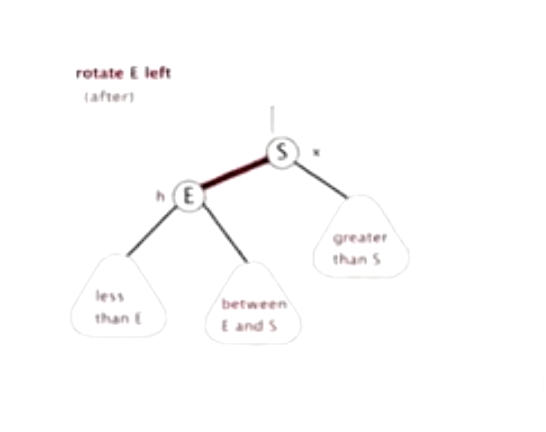

## 右旋转
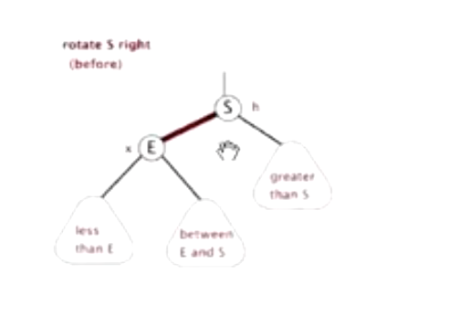
to
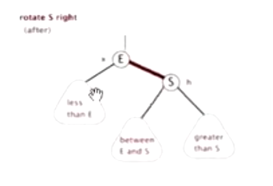


## 旋转和变换颜色的规则
  1: 所有插入的默认节点都是红色
  2: 变颜色情况: 当前节点的父亲节点和叔叔节点都是红色 -----> 父亲节点和叔叔节点变成黑色+爷爷节点变成红色
  3: 左旋: 当前节点的父节点是红色 + 叔叔节点是黑色 + 当前节点是右子树 + 以父节点作为旋转点 
  4: 右旋: 当前节点的父节点是红色 + 叔叔节点是黑色 + 当前节点是右子树 + 把父节点变成黑色 + 爷爷节点变成红色 + 以爷爷节点作为旋转点 


# 
function BinarySearchTree(keys) {
  //Node 构造函数
  let Node = function (key) {
    this.key = key;
    this.left = null;
    this.right = null;
  };

  let root = null;

  let insertNode = (node, newNode) => {
    console.log(
      node,
      newNode,
      'insertNode------node, newNode',
      newNode.key,
      node.key
    );
    if (newNode.key < node.key) {
      if (node.left === null) {
        node.left = newNode;
        console.log(node, 'node--left');
      } else {
        insertNode(node.left, newNode);
      }
    } else {
      if (node.right === null) {
        node.right = newNode;
      } else {
        insertNode(node.right, newNode);
      }
    }
  };

  this.insert = (key) => {
    let newNode = new Node(key);
    console.log('newNode', newNode);
    if (root === null) {
      root = newNode;
    } else {
      insertNode(root, newNode);
    }
  };
  keys.forEach((key) => {
    console.log('KEY', key);
    this.insert(key);
  });
  return root;
}
const keys = ['1', '3', '5', '4', '2'];
BinarySearchTree(keys);

console.log(BinarySearchTree(keys), 'root');

# 栈：：：：：：：：：：：

栈（stack）为自动分配的内存空间，它由系统自动释放；而堆（heap）则是动态分配的内存，大小不定也不会自动释放。

引用类型（object）是存放在堆内存中的，变量实际上是一个存放在栈内存的指针，这个指针指向堆内存中的地址。每个空间大小不一样，要根据情况开进行特定的分配，例如。

var person1 = {name:'joz'}; （栈区）(person1---堆内存地址 1)-----》object1(堆区)

js 深拷贝 vs 浅拷贝：：：：：：：：：：：：
注意：
基本数据类型的特点：直接存储在栈(stack)中的数据 ---------------(String, Number, Boolean, Null, Undefined，Symbol)
引用数据类型的特点：存储的是该对象在栈中引用，真实的数据存放在堆内存里---------------(Object,Array,function...)

1: var a=1 b=a a=2 ----console.log(b) //1
2： var a = {
name:'wei'
};
var b = a; // 新建一个 b 对象，地址指向 a 指向的堆 --------------引用类型的赋值是传址。只是改变指针的指向
a.name='ww' console.log(b.name); // 'ww'

# 浅拷贝方法

1: JSON.parse(JSON.stringify())----------------这种方法虽然可以实现数组或对象深拷贝,但不能处理函数
2: const a= Object.assign({id:1},{id:2}) //会覆盖前面的对象的重复属性

# 深拷贝方法：

function clone(target, map = new Map()) {
if (typeOf target === 'object') {
let cloneTarget = Array.isArray(target) ? [] : {}; //考虑到数组情况了
//解决循环引用问题
if (map.get(target)) {
return map.get(target);
}
map.set(target, cloneTarget);

        for (const key in target) {
            cloneTarget[key] = clone(target[key]);
        }
        console.log('执行')
        return cloneTarget;

    } else {
        return target;
    }

};

# 数组扁平化

function flattenArrayIterative(arr) {
const stack = [...arr];
console.log(stack,'stack',stack.length)
const result = [];

while (stack.length) {
const next = stack.pop();
console.log(next,'next')
if (Array.isArray(next)) {
stack.push(...next);
} else {
result.push(next);
}
}

return result.reverse();
}

栈（stack）又名堆栈，是一种遵循后进先出（LIFO）原则的有序集合,新添加或待删除的元素都保存在栈的末尾，称作栈顶，另一端称作栈底

function Stack() {
this.dataStore = []; //初始化为空
this.top = 0; //记录栈顶位置
this.pop = pop; //出栈
this.push = push; //入栈
this.peek = peek; //查看栈顶元素
this.length = length; //查看栈内元素总数
this.clear = clear; //清空栈

function push(element) {
this.dataStore[this.top++] = element;
}

//取出栈顶元素
function pop() {
return this.dataStore[--this.top];
}

function peek() {
if (this.top > 0) return this.dataStore[this.top - 1];
else return "Empty";
}

function clear() {
delete this.dataStore;
this.dataStore = [];
this.top = 0;
}

function length() {
return this.top;
}
}

var stack = new Stack();
console.log(stack.peek());
stack.push("111");
console.log(stack.peek());

## 回文判断：
function isPalindrome(word) {
var s = new Stack();
for (var i = 0; i < word.length; i++) {
s.push(word[i]);
}

var word = "";

while (s.length() > 0) {
// word += s.pop();
word = s.pop() + word;
}

if (word === word) {
return true;
} else {
return false;
}
}
console.log(isPalindrome("level")); // true

## 队列
队列是只允许在一端进行插入操作,而在另一端进行删除操作的线性表
队列是一种先进先出的线性表,简称 FIFO-------允许插入的一端称为队尾(Rear)允许删除的一端称为队头(Front)。

浏览器执行顺序：执行栈在执行完同步任务之后，如果执行栈为空，
就会去检查微任务（MicroTask）队列是否为空？
------------如果为空的话,就会去执行宏任务队列（MacroTask）
------------如果不为空的话,就会一次性执行完所有的微任务队列
