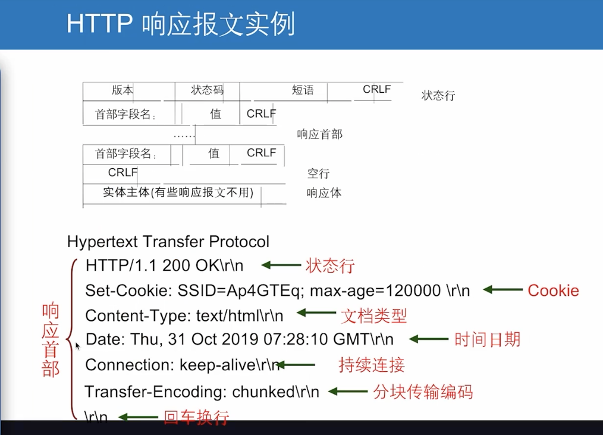

# 计算机最基本的5大组成
## 冯诺曼体系
输入设备(比如键盘)
存储器(比如内存)
运算器(cpu)
控制器(cpu)
输出设备(显示器)

机器语言 二进制
汇编语言 寄存器-->存储体
高级语言 java c++

# 计算机网络 https://juejin.cn/post/6844904079974465544
网络带宽是指在单位时间（一般指的是1秒钟）内能传输的数据量

## OSI网络模型
1 物理层
2 数据链路层
3 网络层
4 运输层
5 会话层
6 表示层
7 应用层

## TCP/IP体系结构 
1 应用层
2 运输层
3 网际层
4 网络接口层

## 五层协议体系结构

1: 应用层  DNS HTTP SMTP  

### HTTP请求报文:
请求方式-请求头-请求体

### HTTP响应报文:

2: 运输层 TCP UDP 

UDP特点:

3: 网络层 IP 
IP协议: 可以使性能各异的网络让用户看起来是同一网络
IP地址:
网络号-子网号-主机号

子网掩码:

4: 数据链路层  
解决了同一局域网计算机间帧的传输问题
不能解决不同局域网的传输问题
局域网
5: 物理层  

铜缆:基于电平
光纤:基于光脉冲
无线:基于微波

通信方式

正交相位调制

## 协议封装

## 实体协议
任何可发送或接收信息的硬件或软件进程。同机器上同一层的实体叫做对等实体

# 操作系统 https://juejin.cn/post/6844904112803282957

cpu从硬盘读取程序到内存中-----进程----线程1 线程2

位图
链表
虚拟内存