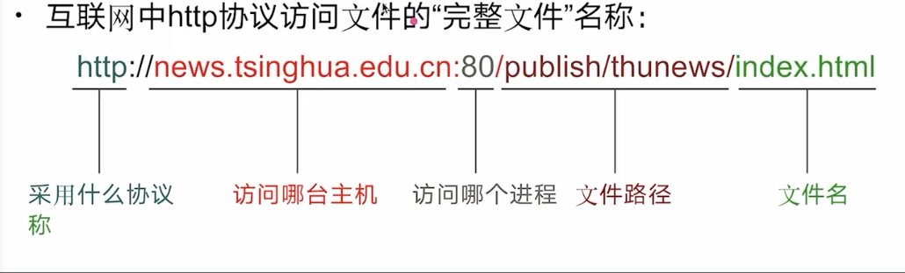

# 计算机最基本的5大组成
## 冯诺曼体系
输入设备(比如键盘)
存储器(比如内存)
运算器(cpu)
控制器(cpu)
输出设备(显示器)

机器语言 二进制
汇编语言 寄存器-->存储体
高级语言 java c++

# 计算机网络 https://juejin.cn/post/6844904079974465544
网络带宽是指在单位时间（一般指的是1秒钟）内能传输的数据量

## OSI网络模型
1 物理层
2 数据链路层
3 网络层
4 运输层
5 会话层
6 表示层
7 应用层

## TCP/IP体系结构 
1 应用层
2 运输层
3 网际层
4 网络接口层

## 五层协议体系结构

1: 应用层  DNS HTTP SMTP  

### HTTP请求报文:
请求方式-请求头-请求体

### HTTP响应报文:

2: 运输层 TCP UDP 

UDP特点:

3: 网络层 IP 
IP协议: 可以使性能各异的网络让用户看起来是同一网络
IP地址:
网络号-子网号-主机号

子网掩码:

4: 数据链路层  
解决了同一局域网计算机间帧的传输问题
不能解决不同局域网的传输问题
局域网

5: 物理层  

铜缆:基于电平
光纤:基于光脉冲
无线:基于微波

通信方式

正交相位调制

## 协议封装

## 实体协议
任何可发送或接收信息的硬件或软件进程。同机器上同一层的实体叫做对等实体

# TCP 可靠性
对于可靠传输，判断丢包，误码靠的是 TCP 的段编号以及确认号。TCP 为了保证报文传输的可靠，就给每个包一个序号，同时序号也保证了传送到接收端实体的包的按序接收。然后接收端实体对已成功收到的字节发回一个相应的确认(ACK)；如果发送端实体在合理的往返时延(RTT)内未收到确认，那么对应的数据（假设丢失了）将会被重传。

# 深度剖析TCP与UDP的区别
https://juejin.cn/post/6992743999756845087
https://github.com/ljianshu/Blog/issues/61

# TCP优缺点
只能是一对一通信  面向连接 面向字节流
首部最小 20 字节，最大 60 字节
1：确认和重传机制 三次握手同步双方的序号,确认号,窗口大小,是确认重传和流量控制的基础。
在传输过程中，如果校验和校验失败，丢包或者延时，发送端会立马重传。
2：数据排序 有专门的序号字段,可以提供数据re-order。
3：流量控制 窗口字段可以指明双方最大的数据传输和接受量
4：拥塞控制 由四个核心算法实现：慢启动，拥塞避免，快速重传，快速恢复

# UDP优缺点
支持一对一，一对多，多对一和多对多交互通信
面向报文 面向无连接的是不需要和 TCP 一样在发送数据前进行三次握手建立连接的
首部开销小，仅8字节 传输数据报文时是很高效的
不可靠性 体现在无连接------设计目标是尽可能地简单和高效。 它不需要在发送数据前进行连接的建立，而是直接发送数据报到目的地
没有拥塞控制 网络不好就一直恒定速度发送 容易丢包

# 应用场景
tcp(传输控制协议),提供的是可靠的运输,基于连接同时也说明需要的时间更长。应用于需要可靠性较高的场所。http请求,文件传输等等。
udp不基于连接。速度更快,应用于网络通讯速度较快的场景。比如语音电话、视频、直播等等。

# 解读 HTTP1/HTTP2/HTTP3
https://juejin.cn/post/6995109407545622542

# HTTP2
1：二进制传输
2：Header 压缩
2：多路复用:可以只通过一个 TCP 连接就可以传输所有的请求数据。

# HTTP/1.1有两个主要的缺点：
安全不足和性能不高。
# HTTP/2完全兼容HTTP/1
是"更安全的HTTP、更快的HTTPS"，二进制传输、头部压缩、多路复用、服务器推送等技术可以充分利用带宽，降低延迟，从而大幅度提高上网体验
# QUIC 
基于 UDP 实现，是 HTTP/3 中的底层支撑协议，该协议基于 UDP，又取了 TCP 中的精华，实现了即快又可靠的协议。

# GET 和 POST 的区别:::::::::::::::::::::::::::::::
1：GET在浏览器回退时是无害的,而POST会再次发起请求。
2：GET请求会被浏览器主动缓存,而POST不会,除非手动设置。
3：GET请求只能进行URL编码,而POST支持多种编码方式 。
4：GET没有POST安全,因为GET请求参数直接暴露在URL上,所以不能用来传递敏感信息。
5：GET浏览器把 http header和data一起发出去,响应成功200 POST先发送header,响应100 continue,再发送data,响应成功200  GET产生一个TCP数据包,POST产生两个数据包(Firefox只发一次)。

# http请求头
Host 接受请求的服务器地址,可以是P端口号,也可以是域名
User-Agent：发送请求的应用程序名称
Connection：定与连接相关的属性 如Connection:Keep-Alve
Accept-Charset：通知服务端可以发送的编码格式
Accept-Encoding：通服务端可以发送的数据压缩格式
Accept-Language：通知服务端可以发送语言

# HTTP 和 HTTPS 的区别 ：：：：：：：：：：：：：：：：：
HTTP是明文传输,不安全的,HTTPS是加密传输,安全的多
HTTP标准端口是80,HTTPS标准端口是443
HTTP不用认证证书免费,HTTPS需要认证证书要钱
连接方式不同,HTTP三次握手,HTTPS中TLS1.2版本7次,TLS1.3版本6次
HTTP在OSI网络模型中是在应用层,而HTTPS的TLS是在传输层
HTTP是无状态的,HTTPS是有状态的

# https的握手过程：：：：：：
客户端使用https的url访问web服务器,要求与服务器建立ssl连接
web服务器收到客户端请求后, 会将网站的证书(包含公钥)传送一份给客户端
客户端收到网站证书后会检查证书的颁发机构以及过期时间, 如果没有问题就随机产生一个秘钥
客户端利用公钥将会话秘钥加密, 并传送给服务端, 服务端利用自己的私钥解密出会话秘钥
之后服务器与客户端使用秘钥加密传输

# 三次握手 ../note/sublime/assets/三次握手.png
第一次握手：客户端Client发送位码为SYN＝1,随机产生seq=x的数据包到服务器,服务器Server由SYN=1知道,客户端Client要求建立联机
第二次握手：服务器Server收到请求后要确认联机信息，向客户端Client发送ack=(客户端Client请求连接时的seq)+1，SYN=1，ACK=1，产生seq=y的包,代表接收到连接请求并且向客户端再次确认；
第三次握手：客户端Client收到后检查ack是否正确，即第一次发送的seq+1，以及位码ACK是否为1，代表收到了服务器端发过来的确认信息。之后客户端Client会再向服务器发送ack=(服务器Server的seq+1)，ACK=1，服务器Server收到后确认ack 值与ACK=1，连接建立成功

# 四次挥手
TCP 是可以双向传输数据的，也就是全双工协议。所以双方都可以主动断开连接，断开连接后主机中的「资源」将被释放。

客户端打算关闭连接，此时会发送一个 TCP 首部 FIN 标志位被置为 1 的报文，也即 FIN 报文，之后客户端进入 FIN_WAIT_1 状态。
服务端收到该报文后，就向客户端发送 ACK 应答报文，接着服务端进入 CLOSED_WAIT 状态。
客户端收到服务端的 ACK 应答报文后，之后进入 FIN_WAIT_2 状态。等待服务端处理完数据后，也向客户端发送 FIN 报文，
之后服务端进入 LAST_ACK 状态。客户端收到服务端的 FIN 报文后，回一个 ACK 应答报文，之后进入 TIME_WAIT 状态服务器收到了 ACK 应答报文后，
就进入了 CLOSE 状态，至此服务端已经完成连接的关闭。客户端在经过 2MSL 一段时间后，自动进入 CLOSE 状态，
至此客户端也完成连接的关闭。你可以看到，每个方向都需要一个 FIN 和一个 ACK，
因此通常被称为四次挥手。这里一点需要注意是：主动关闭连接的，才有 TIME_WAIT 状态。

# 针对TCP连接的安全问题：SYN攻击

# 为什么挥手需要四次？
再来回顾下四次挥手双方发FIN包的过程,就能理解为什么需要四次了。关闭连接时,客户端向服务端发送FIN时,仅仅表示客户端不再发送数据了但是还能接收数据。
服务器收到客户端的 FIN 报文时，先回一个 ACK 应答报文，而服务端可能还有数据需要处理和发送，等服务端不再发送数据时，才发送 FIN 报文给客户端来表示同意现在关闭连接。
从上面过程可知，服务端通常需要等待完成数据的发送和处理，`所以服务端的 ACK 和 FIN 一般都会分开发送,从而比三次握手导致多了一次`。

# TCP 挥手可以只需要三次吗？
可以的。因为服务器端收到客户端的FIN后,服务器端同时也要关闭连接,这样就可以把ACK和FIN合并到一起发送,节省了一个包,变成了“三次挥手”。

# 操作系统 https://juejin.cn/post/6844904112803282957

cpu从硬盘读取程序到内存中-----进程----线程1 线程2

位图
链表
虚拟内存